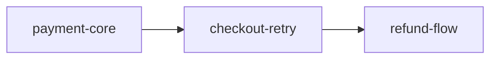

# tene plugin — 문서 표준 (Document Standards)

> 대응 요구사항: FR-2, FR-3, PRD §5
> 목적: 사람과 AI가 **항상 같은 양식**으로 읽고 쓰게 하여, 다음 sprint가 이전 sprint를 기계적으로 참조할 수 있게 한다

---

## 0. 공통 규약

### 0.1 문서 종류와 위치

| 종류 | 파일 | 폴더 | 생성 단계 | 작성 주체 |
|---|---|---|---|---|
| **Master Plan** | `master-plan.md` | `docs/sprints/` | 최초 1회 + 갱신 | `/tene:master-plan` |
| **PRD** | `prd.md` | `<sprint>/00-prd/` | prd | `/tene:prd` (인터뷰) |
| **Plan** | `plan.md` | `<sprint>/01-plan/` | plan | `/tene:plan` |
| **Design** | `design.md` | `<sprint>/02-design/` | design | `/tene:design` |
| **Analysis** | `loop-check-<n>.md` | `<sprint>/03-analysis/` | check (반복마다) | `/tene:loop-check` |
| **QA** | `qa.md` | `<sprint>/03-analysis/` | qa | `/tene:qa` |
| **Report** | `report.md` | `<sprint>/04-report/` | report | `/tene:report` |

### 0.2 세 가지 표기 규칙

| 규칙 | 표기 | 의미 |
|---|---|---|
| **필수 섹션** | `## [필수]` 없이 그냥 정해진 제목 | 누락 시 게이트 실패 |
| **자유 관점** | `## +@ <제목>` | 자유 추가. 검증 통과에 영향 없음 |
| **자동 생성 영역** | `<!-- tene:auto:start -->` … `<!-- tene:auto:end -->` | 사람이 편집하지 않음. 재생성 시 덮어씀 |

> `+@` 접두사가 자유 관점의 표식이다. 검증기는 `+@` 로 시작하는 섹션을 통과시킨다.

### 0.3 신뢰 등급 표기 (모든 문서 공통)

사실을 기록할 때는 **어디서 얻었는지**를 반드시 붙인다.

| 표기 | 의미 | 신뢰 |
|---|---|---|
| `lsp` | 언어 서버 (CIA Tier 1) | 높음 |
| `indexed` | 플러그인 자체 인덱서 (CIA Tier 2) | 중간 |
| `investigated` | 에이전트가 Glob/Grep/Read 로 직접 조사 (CIA Tier 3) | 중간 |
| `rules-project` | 프로젝트 계층 규칙 파일 매칭 | 높음 |
| `rules-default` | 기본 프리셋 매칭 | 중간 |
| `imports` | import 시그널로 추정한 계층 | 낮음 |
| `human` | 사람이 제공 | 높음 |
| `inferred` | AI 추론 — **확정 아님** | 낮음 |
| `unclassified` | 규칙에 매칭되지 않음 — **지어내지 않는다** | — |
| `insufficient` | 확인하지 못함 — pass도 fail도 아님 | — |

신뢰가 `높음`이 아닌 항목은 표에 `confidence` 를 함께 적는다: `indexed, confidence: medium`.

### 0.4 공통 frontmatter

```yaml
---
tene:
  sprint: checkout-retry          # sprint id
  doc: prd                        # prd|plan|design|analysis|qa|report|master-plan
  phase: prd                      # 생성 시점의 사이클 단계
  status: draft                   # draft | active | done | superseded
  created: 2026-08-20
  modified: 2026-08-20
  supersedes: []                  # 대체한 이전 문서 경로
  anchors:                        # 이 문서가 참조하는 코드 지점
    - symbol: processPayment
      file: src/payments/processPayment.ts
  cia: indexed                    # lsp | indexed | investigated (코드 지능 Tier)
  sources: [rules-project, indexed, human]   # 이 문서가 사용한 사실 출처
---
```

---

## 1. PRD (`00-prd/prd.md`)

기획 의도를 붙잡는 문서. **이 문서의 AC가 이후 모든 검증의 판정 기준이 된다.**

### 필수 섹션

```markdown
# <기능명> — PRD

## 1. 배경과 문제
- 지금 무엇이 불편한가 (사용자 관점 서술)
- 이 문제를 방치하면 무슨 일이 생기는가

## 2. 목표
- 이 sprint가 달성하려는 것 (측정 가능한 형태)
- 성공을 무엇으로 확인하는가

## 3. 범위 밖 (Non-goals)
- 이번에 **하지 않을** 것과 그 이유
> ⚠️ 필수. 비어 있으면 게이트 실패. "없음"이라도 명시적으로 적는다.

## 4. 사용자 흐름 (UX Flow)
- 시작점 → 정상 경로 → 종료점
- **실패 경로**: 어디서 실패하고 어디로 가는가
- **되돌아오는 경로**: 뒤로가기 / 새로고침 / 중복 클릭 / 재시도


## 5. 데이터 처리 흐름 (Data Flow)
- 입력이 어디서 발생해 어디에 남는가
- 실패 시 데이터는 어떻게 되는가 (롤백/부분기록/미기록)

## 6. 수용 기준 (AC)
| ID | 기준 (EARS) | 방식 | 앵커 | 상태 |
|---|---|---|---|---|
| AC-1 | **When** … , 시스템은 … 해야 한다 | UX | (design에서 확정) | pending |
| AC-2 | **If** … , **then** 시스템은 … 해야 한다 | DATA | | pending |

## 7. 열린 결정 사항
| # | 결정할 것 | 선택지 | 기본 제안 | 결정자 |
|---|---|---|---|---|

## +@ (자유)
```

### AC 작성 규칙

1. **EARS 5패턴** 중 하나로 쓴다 (Ubiquitous / When / While / If-then / Where)
2. **방식**을 반드시 태깅한다: `UNIT` | `DATA` | `UX`
3. 하나의 AC는 **하나의 판정**만 담는다. "그리고"로 이어진 문장은 분리한다
4. **Unwanted behavior(If-then) 패턴을 최소 1개 이상** 포함한다 — 바이브 코딩이 가장 잘 빠뜨리는 영역
5. 판정 불가능한 형용사 금지: "빠르게", "직관적으로", "적절히" → 측정 가능한 수치나 관찰 가능한 상태로

### 인터뷰 질문 축 (스킬이 사용)

| 라운드 | 목표 | 질문 |
|---|---|---|
| R1 | 배경·목표 | 이게 없으면 사용자가 뭘 못 하나? 성공을 어떻게 알 수 있나? |
| R2 | **범위 밖** | 비슷해 보이지만 이번에 안 할 것은? 왜 미루나? |
| R3 | UX 흐름 | 어디서 시작해 어디로 끝나나? 중간에 실패하면 어디로 가나? |
| R4 | **되돌아오는 경로** | 뒤로가기·새로고침·중복 제출·재시도는 어떻게 되나? |
| R5 | 데이터 흐름 | 어떤 데이터가 어디에 남나? 실패하면 남나 안 남나? |
| R6 | **실패 조건** | "이러면 버그다"라고 말할 수 있는 상황은? |
| R7 | 검증 방식 | 각 기준을 무엇으로 증명할 건가? (UNIT/DATA/UX) |

---

## 2. Plan (`01-plan/plan.md`)

무엇을 어떤 순서로 할지. **AC 커버리지가 이 문서의 존재 이유다.**

```markdown
# <기능명> — Plan

## 1. 작업 항목
| # | 작업 | 커버하는 AC | 예상 계층 | 선행 |
|---|---|---|---|---|
| T1 | 결제 실패 응답 처리 | AC-2 | Business Logic | — |
| T2 | 입력값 보존 상태 관리 | AC-1 | Interface | T1 |

## 2. AC 커버리지
<!-- tene:auto:start -->
| AC | 커버 작업 | 상태 |
|---|---|---|
| AC-1 | T2 | covered |
| AC-2 | T1 | covered |
| AC-3 | — | ⚠️ **uncovered** |
<!-- tene:auto:end -->
> 커버되지 않은 AC가 있으면 G2 게이트 실패.

## 3. 영향 범위 (사전 조사)
| 대상 | 영향 | 출처 |
|---|---|---|
| `processPayment` | 시그니처 변경 없음, 분기 추가 | indexed (refs 2건) |
| `POST /api/v1/payments` | 응답 스키마에 `reason` 추가 | investigated |

## 4. 순서와 의존
- 실행 순서와 병렬 가능 항목

## 5. 위험과 대비
| 위험 | 영향 | 대비 |
|---|---|---|

## 6. 이번에 하지 않는 것
- plan 단계에서 의도적으로 제외한 항목과 사유

## +@ (자유)
```

---

## 3. Design (`02-design/design.md`)

처리 로직 상세 설계. **Understanding Layer 4계층 분류가 필수다.**

```markdown
# <기능명> — Design

## 1. 설계 개요
- 무엇을 어떻게 만드는지 한 문단

## 2. Understanding Layer 분류
<!-- tene:auto:start  cia: indexed  rules: docs/sprints/_meta/layers.yml -->
### Interface (Entry Point)
| 대상 | 파일 | 신규/수정 | 출처 |
|---|---|---|---|
| `CheckoutPage` | src/pages/CheckoutPage.tsx:12 | 수정 | rules-project |

### Business Logic (Processing rules)
| 대상 | 파일 | 신규/수정 | 출처 |
|---|---|---|---|
| `processPayment` | src/payments/processPayment.ts:42 | 수정 | rules-project |

### Persistence (Data)
| 대상 | 파일 | 신규/수정 | 출처 |
|---|---|---|---|
| `paymentsRepo.insert` | src/db/payments.ts:30 | 수정 | imports, confidence: medium |

### Infrastructure (Runtime)
| 대상 | 파일 | 신규/수정 | 출처 |
|---|---|---|---|
| (해당 없음) | | | |

### 미분류 (규칙에 매칭되지 않음)
| 대상 | 파일 | 사유 |
|---|---|---|
| `retryJob` | src/jobs/retry.ts:7 | 규칙 미매칭 — `src/jobs/**` 를 layers.yml 에 추가 검토 |
<!-- tene:auto:end -->

> 4계층 각각에 대해 "해당 없음"을 포함해 **반드시 명시**한다. 비워두면 G3 게이트 실패.

## 3. 계층 위반 점검
<!-- tene:auto:start -->
| 종류 | 내용 | 근거 |
|---|---|---|
| layer-skip | `CheckoutPage` 가 `paymentsRepo` 를 직접 호출 (Interface → Persistence) | indexed, confidence: medium |
<!-- tene:auto:end -->

## 4. 처리 로직 상세
### 4.1 <로직명>
- 입력 → 처리 → 출력
- 분기 조건과 각 분기의 결과
- 실패 처리와 부작용

## 5. 6가지 질문 — 변경 대상 심볼별
<!-- tene:auto:start -->
### `processPayment`
| 질문 | 답변 | 출처 |
|---|---|---|
| Q1 선언·정의된 이름 | `processPayment` (function) | indexed |
| Q2 정의 파일 | `src/payments/processPayment.ts:42` | indexed |
| Q3 import·참조 위치 | `src/api/routes/payments.ts:18`, `src/jobs/retry.ts:7` | indexed |
| Q4 호출·사용 위치 | `POST /api/v1/payments` ← `CheckoutPage.onSubmit` | indexed, confidence: medium |
| Q5 입력 데이터 형태 | `{ amount: number; cardToken: string; idempotencyKey?: string }` | indexed (signature) |
| Q6 반환·변경 데이터 | `Promise<PaymentResult>` · `payments` INSERT/UPDATE | indexed + investigated |
<!-- tene:auto:end -->

### 해석과 위험 (사람/AI 서술)
- Q3에서 발견: `src/jobs/retry.ts` 가 동일 함수를 호출한다. 설계에 없던 경로 → 중복 결제 위험

## 6. 데이터 계약
| 대상 | 입력 스키마 | 출력 스키마 | 출처 |
|---|---|---|---|

## 7. 화면 전이 설계

| 엣지 | 트리거 | 대상 AC |
|---|---|---|
| CheckoutPage → Processing | 결제 클릭 | AC-3 |
| Processing → CheckoutPage | 4xx 응답 | AC-1 |

> 이 표의 엣지 수가 **QA 전이 커버리지의 분모**가 된다.

## 8. AC 앵커 확정
| AC | 앵커 |
|---|---|
| AC-1 | `CheckoutPage` |
| AC-2 | `processPayment`, `paymentsRepo.insert` |

## +@ (자유)
```

---

## 4. Analysis / Check (`03-analysis/check-<n>.md`)

문서 대비 구현 일치율. **반복(loop)마다 새 파일을 만든다** — 개선 궤적이 남아야 한다.

```markdown
# <기능명> — Check #<n>

## 1. 판정 요약
<!-- tene:auto:start -->
| 항목 | 값 |
|---|---|
| 반복 회차 | 2 / 5 |
| 일치율 | 87% (13/15) |
| 목표 | 100% |
| 판정 | **미달 — 개선 계속** |
<!-- tene:auto:end -->

## 2. 문서 ↔ 구현 대조
| 출처 | 요구 항목 | 구현 상태 | 근거 | 판정 |
|---|---|---|---|---|
| PRD AC-1 | 실패 시 입력값 보존 | 구현됨 | src/pages/CheckoutPage.tsx:88 | ✅ |
| PRD AC-2 | status='failed' 기록 | **누락** | CIA 쓰기 호출 탐지 결과 없음 (indexed) | ❌ |
| Design §4.1 | 3초 타임아웃 분기 | 부분 구현 | 타임아웃 값 하드코딩 5초 | ⚠️ |

## 3. Understanding Layer 대조
| 계층 | 설계 | 실제 | 차이 |
|---|---|---|---|
| Interface | CheckoutPage 수정 | 일치 | — |
| Persistence | paymentsRepo.insert 수정 | **미수정** | AC-2 누락 원인 |

## 4. 계층 위반 / 기술부채
| 종류 | 내용 | 근거 | 심각도 |
|---|---|---|---|

## 5. 개선 작업
| # | 갭 | 조치 | 대상 AC |
|---|---|---|---|
| F1 | AC-2 미구현 | paymentsRepo 에 실패 기록 추가 | AC-2 |

## 6. 이번 회차에서 하지 않은 것
- 사유와 함께

## +@ (자유)
```

---

## 5. QA (`03-analysis/qa.md`)

**하네스 게이트의 판정 근거 문서**다. 이 문서의 판정이 G6를 좌우한다.

```markdown
# <기능명> — QA

## 1. 게이트 판정
<!-- tene:auto:start -->
| 항목 | 값 |
|---|---|
| 전체 AC | 5 |
| pass | 3 |
| fail | 1 |
| insufficient | 1 |
| stale | 0 |
| **게이트** | ❌ **FAIL** (fail 1건) |
| 전이 커버리지 | 3 / 5 엣지 (60%) |
<!-- tene:auto:end -->

> 게이트 규칙: `fail == 0` 이고 `stale == 0` 이어야 pass.
> `insufficient` 는 게이트를 막지 않지만 **report에 반드시 사유가 기록**된다.

## 2. 검증 환경
| 도구 | 가용 | 버전/비고 |
|---|---|---|
| 테스트 러너 | ✅ vitest | 3.1.0 |
| 코드 지능 (CIA) | ⚠️ Tier 2 (자체 인덱서) | LSP 미설치 — 6질문 신뢰 `indexed` |
| 계층 규칙 | ✅ 프로젝트 규칙 | docs/sprints/_meta/layers.yml |
| 브라우저 | ⛔ Chrome MCP 미연결 | → Playwright 사용 |

## 3. AC별 판정
| AC | 방식 | 판정 | 증거 | 반박 검증 |
|---|---|---|---|---|
| AC-1 | UX | ✅ pass | `evidence/AC-1.gif` | 3/3 반박 실패 (유지) |
| AC-2 | DATA | ❌ fail | `evidence/AC-2.json` — payments 테이블에 기록 없음 | — |
| AC-3 | UX | ⬜ insufficient | 타임아웃 시나리오 미실행 (5초 대기 환경 부재) | — |

## 4. UX 흐름 검증
### 4.1 전이 커버리지
| 엣지 | 측정 | 결과 | 증거 |
|---|---|---|---|
| CheckoutPage → Processing | ✅ | 정상 | evidence/e1.png |
| Processing → CheckoutPage (4xx) | ✅ | 입력값 보존 확인 | evidence/e2.gif |
| Processing → ErrorPage (5xx) | ⬜ | 미측정 | — |

### 4.2 되돌아오는 경로
| 시나리오 | 결과 |
|---|---|
| 뒤로가기 후 상태 보존 | ✅ |
| 새로고침 후 복구 | ❌ 입력값 소실 |
| 중복 제출 방지 | ⬜ 미측정 |

## 5. 데이터 처리 흐름 검증
| 검증 | 질의 | 결과 |
|---|---|---|
| 입력 → 영속화 경로 | CIA refs + 실행 로그 대조 | CheckoutForm.state → POST → **DB 기록 없음** |
| 변경 지점 | CIA 쓰기 호출 탐지 | `payments` 에 INSERT 만 존재, 실패 시 UPDATE 없음 |
| 엔드포인트 계약 일치 | 설계 문서 §6 대비 실제 응답 | 응답에 `reason` 필드 미포함 (설계와 불일치) |

## 6. 유닛/통합 테스트
| 스위트 | 결과 | 커버리지 |
|---|---|---|

## 7. 미측정 항목과 사유
| 항목 | 사유 | 측정하려면 |
|---|---|---|
| AC-3 | 타임아웃 재현 환경 부재 | 목 서버에 지연 주입 필요 |
| Processing → ErrorPage | 5xx 재현 불가 | 동일 |

> ⚠️ 미측정을 0% 또는 pass 로 표기하지 않는다.

## 8. 후속 조치
| # | 조치 | 대상 | 우선순위 |
|---|---|---|---|

## +@ (자유)
```

---

## 6. Report (`04-report/report.md`)

**사용자와 AI가 함께 회고하는 문서.** PRD §5의 R1~R6이 필수다.

```markdown
# <기능명> — Sprint Report

## 0. 요약
<!-- tene:auto:start -->
| 항목 | 값 |
|---|---|
| Sprint | checkout-retry |
| 기간 | 2026-08-18 ~ 2026-08-20 |
| 최종 일치율 | 100% |
| QA 게이트 | ✅ pass |
| 전이 커버리지 | 5/5 (100%) |
| 이월 항목 | 2건 |
<!-- tene:auto:end -->

## R1. 이전 sprint와의 연결
> "이전 사이클로 구현한 내용들과 어떻게 기능이 이어지는가"

| 이전 sprint | 산출물 | 이번 sprint와의 관계 | 근거 |
|---|---|---|---|
| `payment-core` | `processPayment` | 이번에 실패 분기를 확장 | indexed (callers) |
| `checkout-ui` | `CheckoutPage` | 이번에 상태 보존 로직 추가 | indexed (refs) |

### 연결이 끊긴 지점
- (있다면) 이전 sprint 산출물 중 이번 변경으로 사용되지 않게 된 것

## R2. 생성·수정한 파일과 구현 내용
> "어떤 파일을 생성 수정하였으며, 어떤 기능들을 어떻게 구현하였는가"

<!-- tene:auto:start  source: git + rules-project -->
| 파일 | 변경 | 계층 | 구현 내용 |
|---|---|---|---|
| `src/payments/processPayment.ts` | 수정 (+42/-8) | Business Logic | 4xx 응답 시 실패 기록 후 사유 반환 |
| `src/db/payments.ts` | 수정 (+15/-0) | Persistence | `markFailed()` 추가 |
| `src/pages/CheckoutPage.tsx` | 수정 (+30/-5) | Interface | 실패 응답 시 폼 상태 복원 |
<!-- tene:auto:end -->

## R3. 기획 의도 충족 매핑
> "개발한 처리 로직은 기획 의도 무엇을 충족시키기 위해 개발했는가"

| 구현 | 충족한 AC | 기획 의도 (PRD 인용) |
|---|---|---|
| `markFailed()` | AC-2 | "실패해도 어떤 시도가 있었는지 추적할 수 있어야 한다" |
| 폼 상태 복원 | AC-1 | "모바일에서 재입력 비용이 크므로 이탈을 막는다" |

### 의도와 다르게 구현된 것
- (있다면) 구현 과정에서 의도를 변경한 항목과 승인 여부

## R4. Understanding Layer 기준 작업 내역
> 4계층 각각에 대해 "해당 없음"을 포함해 반드시 기재

<!-- tene:auto:start  cia: indexed -->
### Interface (Entry Point)
- `CheckoutPage` — 실패 응답 처리 분기 추가 (src/pages/CheckoutPage.tsx:88)

### Business Logic (Processing rules)
- `processPayment` — 4xx 분기 확장 (src/payments/processPayment.ts:42)

### Persistence (Data)
- `paymentsRepo.markFailed` — 신규 (src/db/payments.ts:45)

### Infrastructure (Runtime)
- 해당 없음

### 미분류
- 해당 없음
<!-- tene:auto:end -->

### 계층 균형 평가
- 이번 sprint의 작업이 특정 계층에 쏠렸는가? 그것이 타당한가?

## R5. 6가지 질문 답변
> 이번 sprint에서 수정·개발한 처리 로직 각각에 대해

<!-- tene:auto:start  cia: indexed -->
### `processPayment`
| 질문 | 답변 |
|---|---|
| 선언·정의된 이름 | `processPayment` (function) |
| 정의 파일 | `src/payments/processPayment.ts:42` |
| import·참조 위치 | `src/api/routes/payments.ts:18`, `src/jobs/retry.ts:7` |
| 호출·사용 위치 | `POST /api/v1/payments` ← `CheckoutPage.onSubmit`, `retryJob.run` |
| 입력 데이터 | `{ amount: number; cardToken: string; idempotencyKey?: string }` |
| 반환·변경 데이터 | `Promise<PaymentResult>` · `payments` INSERT/UPDATE |

### `paymentsRepo.markFailed`
| 질문 | 답변 |
|---|---|
| … | … |
<!-- tene:auto:end -->

### 이 답변에서 드러난 것
- `retryJob` 이 동일 함수를 호출한다는 사실은 설계 단계에 없었다 → R6로 이월

## R6. 사용자 결정 대기 · 이월 작업
> "내가 정해야 하는 정책이나 이월시킨 작업은 무엇이며, 왜 이번 스프린트에서 하지 않았는가"

### 결정이 필요한 정책
| # | 결정할 것 | 선택지 | 영향 | 왜 지금 정해야 하나 |
|---|---|---|---|---|
| D1 | 재시도 잡의 멱등키 정책 | (a) 원 결제와 동일 키 (b) 새 키 | 중복 결제 위험 | R5에서 발견된 미설계 호출 경로 |

### 이월 작업
| # | 작업 | 왜 이번에 하지 않았나 | 언제 할 것인가 |
|---|---|---|---|
| C1 | 5xx → ErrorPage 전이 검증 | 5xx 재현 환경이 없어 측정 불가 | 목 서버 지연 주입 도구 도입 후 |
| C2 | 새로고침 후 상태 복구 | AC로 정의되지 않았음(범위 밖) | 다음 sprint PRD에서 결정 |

## +@ (자유 회고)
- 잘된 것 / 아쉬운 것 / 다음에 다르게 할 것
```

---

## 7. Master Plan (`docs/sprints/master-plan.md`)

```markdown
# Sprint Master Plan

## 0. 현황
<!-- tene:auto:start -->
| Sprint | 상태 | Phase | 일치율 | QA | 기간 |
|---|---|---|---|---|---|
| payment-core | archived | — | 100% | pass | 08-10~08-14 |
| checkout-retry | active | qa | 100% | fail | 08-18~ |
| refund-flow | planned | — | — | — | — |
<!-- tene:auto:end -->

## 1. 목표와 배경
- 이 master plan이 달성하려는 상위 목표

## 2. Sprint 목록과 순서
| # | Sprint | 목표 | 선행 | 예상 기간 |
|---|---|---|---|---|

## 3. Sprint 간 의존


## 4. 공통 제약
- 전체에 걸친 기술/정책 제약

## 5. 이월·미결 집계
<!-- tene:auto:start -->
| 출처 sprint | 항목 | 종류 | 상태 |
|---|---|---|---|
| checkout-retry | D1 재시도 멱등키 정책 | 결정대기 | open |
| checkout-retry | C1 5xx 전이 검증 | 이월 | open |
<!-- tene:auto:end -->

## +@ (자유)
```

> **이월·미결 집계가 master plan의 핵심 가치다.** 개별 sprint의 R6가 여기로 자동 승격되어, 미결 항목이 조용히 사라지지 않는다.

---

## 8. 문서 검증 규칙 (게이트가 쓰는 체크리스트)

| 문서 | 검증 항목 | 게이트 |
|---|---|---|
| PRD | frontmatter 유효 / §3 범위 밖 비어있지 않음 / AC ≥ 1 / AC마다 방식 태그 / If-then 패턴 ≥ 1 | G1 |
| Plan | 모든 AC가 최소 1개 작업에 커버됨 | G2 |
| Design | 4계층 각각 명시(해당없음 포함) / 6질문 표 존재 / 화면 전이 엣지 정의 / AC 앵커 확정 | G3 |
| Analysis | 일치율 수치 존재 / 갭마다 조치 항목 존재 | G5 |
| QA | 모든 AC에 판정 존재 / `fail`==0 / `stale`==0 / 미측정에 사유 존재 | G6 |
| Report | R1~R6 전부 존재 / R4의 4계층 전부 기재 / R6 이월 사유 존재 | G7 |

**공통**: `+@` 섹션의 존재·부재는 검증에 영향을 주지 않는다.

---

## 9. 왜 이 양식인가 — 설계 근거

| 양식 요소 | 방어하는 실패 |
|---|---|
| PRD **범위 밖** 필수 | 스코프 크리프, "이것도 해주세요"의 무한 확장 |
| AC **EARS 정규화** | 판정 불가능한 모호한 요구사항 |
| AC **If-then 최소 1개** | 실패 경로 미고려 (바이브 코딩 최대 약점) |
| PRD **되돌아오는 경로** 질문 | 뒤로가기·새로고침·중복 제출 버그 |
| Plan **AC 커버리지 표** | 요구사항 누락 구현 |
| Design **4계층 필수 기재** | 잘못된 계층 배치, 구조 무시 |
| Design **6질문 표** | 기존 구현 중복, 참조 지점 누락 |
| Design **화면 전이 엣지** | QA 커버리지 분모 부재 |
| Analysis **회차별 파일** | 개선 궤적 소실 |
| QA **insufficient 1급** | 미측정을 통과로 위장 |
| QA **증거 경로 필수** | "됐습니다" 주장만 남는 것 |
| Report **R1 이전 연결** | 고립된 기능, 중복 구현 |
| Report **R5 6질문** | 단편적 판단으로 인한 기술부채 |
| Report **R6 이월 사유** | 조용히 사라지는 미결 항목 |
| Master **이월 집계** | sprint를 넘어 잊히는 결정 사항 |
