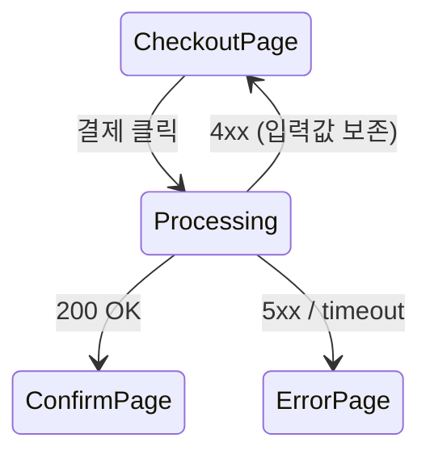

# 04. 의도(Intent) 기반 종합 QA 연구
### 대화로 기획 의도를 추출·보관·갱신하고, 이를 UX 흐름 / 데이터 처리 흐름 QA로 전개하는 방법

> 조사일: 2026-08-20
> 문제 제기: *"AI Agent로 QA를 하면 test script 기반 unit/e2e 테스트만 할 뿐, **기능 기획 의도를 이해하여** UX 흐름 및 데이터 처리 흐름에 따른 화면 전이 등 종합 테스트는 불가능하다."*

---

## 0. 결론 먼저

문제의 본질은 **AI가 테스트를 못 만드는 것이 아니라, 판정 기준(oracle)이 없다는 것**이다.

- 유닛/E2E 스크립트가 판정할 수 있는 것은 **코드에 이미 쓰여 있는 것**뿐이다. "이 화면 다음에 저 화면이 와야 한다"는 코드에 없다. **사람 머릿속에만 있다.**
- 따라서 해법은 더 좋은 테스트 생성기가 아니라, **의도를 판정 가능한 형태로 외부화하고, 코드 변경에 맞춰 살아있게 유지하는 저장소**다.
- Claude Code는 이를 구현할 프리미티브를 이미 전부 갖고 있다: `AskUserQuestion`(추출) · Skills/Hooks(강제) · auto memory + git 문서(보관) · Dynamic Workflow(규모) · Chrome MCP(UX 흐름 실행) · tene MCP 그래프(데이터 흐름 구조).
- 제안 아키텍처는 **Intent Ledger(의도 원장)** — 4계층(Intent / Flow / Contract / Evidence)으로 의도를 정규화하고, 코드 그래프에 앵커링하며, QA는 이 원장을 oracle 삼아 실행한다.

---

## 1. 문제의 정밀화 — 왜 지금의 AI QA는 "종합 테스트"를 못 하는가

### 1.1 세 가지 근본 원인

| # | 원인 | 설명 |
|---|---|---|
| **1** | **Test Oracle 부재** | 테스트는 "무엇이 옳은가"를 알아야 판정한다. 유닛 테스트의 oracle은 개발자가 쓴 `expect()`. E2E의 oracle은 셀렉터와 어서션. **둘 다 코드에서 유도된 것**이라 "코드가 기획과 다르게 구현된 경우"를 절대 잡지 못한다. |
| **2** | **의도의 휘발** | 기획 의도는 Slack/회의/PR 코멘트/대화 세션에 흩어지고, 세션이 끝나면 사라진다. Claude Code의 각 세션은 **새 컨텍스트로 시작**하므로 다음 세션은 "왜 이렇게 만들었는지"를 모른다. |
| **3** | **흐름의 비국소성(non-locality)** | "장바구니 → 결제 → 실패 시 이전 화면 복귀 + 입력값 보존"은 어떤 단일 파일에도 없다. 화면·API·상태·DB에 걸쳐 있다. grep으로는 재구성 불가. |

### 1.2 업계도 같은 진단을 하고 있다

- *"AI 에이전트는 반복적·구조화된 테스트(회귀, 스모크, 크로스브라우저, 시각 회귀, API 계약)에는 탁월하지만, 사용성 테스트·접근성 평가·복잡한 탐색적 테스트·**새로운 상황에서의 비즈니스 맥락 이해**에 필요한 인간의 판단에는 아직 미치지 못한다."*
- 2026년의 변곡점은 *"AI 추론 능력이 **시각적 맥락만으로 애플리케이션 의도를 추론**할 수 있는 임계를 넘은 것"* 으로 기술된다. 에이전트가 요구사항 문서 없이도 인터페이스를 관찰하고 기저 비즈니스 로직을 모델링하기 시작했다.
- 성숙한 2026 스택은 **피라미드**로 정리된다: 바닥에 빠른 결정론적 유닛/API 테스트, 중간에 핵심 경로의 스크립트 E2E 회귀, **꼭대기에 폭·탐색적 커버리지·UI 변화 내성을 제공하는 에이전틱 레이어**. 각 층이 아래 층이 놓친 것을 잡는다.

> **핵심**: 에이전틱 레이어를 얹는 것까지는 업계 합의다. 하지만 **그 레이어에게 무엇을 판정 기준으로 줄 것인가**는 미해결이고, 여기가 tene의 기회 영역이다.

---

## 2. 경쟁 제품 조사

### 2.1 AI QA 에이전트 (실행 계층)

| 제품 | 접근 | 의도(intent) 취급 | 한계 |
|---|---|---|---|
| **Momentic** | **intent-based locator**. "Submit 버튼 클릭"을 CSS 셀렉터가 아닌 *의도*로 저장, 매 실행마다 레이아웃·맥락·목적을 이해해 요소를 찾음. AI 어서션 | 요소 수준 의도 O / **기능 의도 X** | UI 변화 내성은 뛰어나나, 판정 기준은 여전히 사람이 쓴 테스트 |
| **QA.tech** | 실제 사용자 행동을 모사하는 **탐색적 테스트** 에이전트. 웹/모바일/API 다중 애플리케이션 플로우 | 자율 탐색으로 의도를 *추측* | 추측한 의도가 기획 의도와 일치한다는 보장 없음 |
| **testRigor** | **평문 영어** 테스트 작성 | 자연어가 곧 스펙 | 스펙 자체는 사람이 유지, 드리프트 감지 없음 |
| **Meticulous** | 실제 트래픽 기록 → 시각 회귀 | 의도 없음, 현상 유지 검증 | "지금이 옳다"는 가정 |
| **Heal.dev / OctoMind / Ranger / Robin / Spur / Autonoma** | 자가 치유(self-healing), 자율 QA 에이전트 | 대부분 요소/스크립트 수준 | 동일 |

**공통 한계**: 전부 *"이미 만들어진 앱"*을 대상으로 사후에 테스트를 짠다. **기획 대화에서 의도를 캡처하는 단계가 없다.** 그래서 "구현이 기획과 다르다"는 유형의 결함은 구조적으로 잡을 수 없다.

### 2.2 Spec-Driven Development 프레임워크 (의도 계층)

| 프레임워크 | 포지션 | 특징 | 규모(2026) |
|---|---|---|---|
| **GitHub Spec Kit** | 오피니언 있는 SDD 툴킷 | 스펙을 중심 진실원으로 하는 에이전트 워크플로 구조화 | 80,000+ stars |
| **BMAD-METHOD** | 페이즈 게이트 애자일 방법론 | PM/아키텍트/UX/개발/QA/스크럼마스터 등 **12+ 전문 에이전트**가 SDLC 전체 담당 | 46,700+ stars, v6.6.0 (2026-04-29) |
| **GSD Core** | 컨텍스트 엔지니어링 프레임워크 | 페이즈 루프 강제 | 61,000+ stars (5개월 만) |
| **OpenSpec** | 경량·벤더 중립 스펙 포맷 | 포맷 표준화에 집중 | — |
| **AWS Kiro** | 가장 통합된 agentic IDE | IDE 일체형 | — |
| **Tessl** | **spec-as-source** | 스펙이 유지 대상 아티팩트, 코드는 생성물 | 자사 블로그가 한계 인정: *"같은 스펙이 다른 에이전트에서 다른 코드를 만든다"* |

**SDD 구현 스펙트럼**:
```
Spec-first          → 처음에만 스펙 작성 (이후 드리프트)
Spec-anchored       → 기능 수명 내내 스펙 유지          ← tene 의 목표 지점
Spec-as-source      → 스펙만 편집하면 코드가 재생성      ← 재현성 문제로 아직 미성숙
```

**공통 한계**: 스펙은 잘 만들지만 **QA로 연결되지 않는다.** 수용 기준이 실행 가능한 검증으로 자동 변환되지 않고, 코드 변경 시 스펙이 낡았다는 것을 알려주지 않는다.

### 2.3 요구사항 관리 / 추적성 (거버넌스 계층)

- **Jama, Visure** 등은 AI 기반 요구사항 추적성을 제공: *"AI 도구가 트레이스 링크를 지속적으로 유지하고, 상위 요구사항이 수정되는 순간 의심스러운 관계를 플래그한다 — 수 주가 아니라 수 시간 내에 갭을 잡는다."*
- 요구사항 품질 스코어링은 **INCOSE, EARS** 같은 인정된 프레임워크에 기반하며 NLP가 이미 프로덕션 수준.

**시사점**: 엔터프라이즈 요구사항 관리 세계에는 **추적성 매트릭스(RTM)와 드리프트 감지**라는 성숙한 개념이 이미 있다. AI 코딩 도구 세계는 이것을 아직 흡수하지 못했다. **tene 이 이 둘을 잇는 것이 차별화 포인트다.**

### 2.4 시장 공백 정리

```
                의도 캡처   의도 보관   의도 갱신   코드 구조 연결   QA 실행
Momentic 등        ✗          ✗          ✗            ✗            ●
Spec Kit/BMAD      ●          ●          △            ✗            ✗
Jama/Visure        ●          ●          ●            ✗            ✗
CodeGraph 등       ✗          ✗          ✗            ●            ✗
─────────────────────────────────────────────────────────────────────
tene (목표)        ●          ●          ●            ●            ●
```

**누구도 다섯 칸을 다 채우지 못했다.** 그리고 tene은 이미 코드 그래프(tene studio MCP)를 갖고 있어 네 번째 칸이 채워진 상태에서 출발한다.

---

## 3. 방법론 조사

### 3.1 EARS (Easy Approach to Requirements Syntax)

모호한 요구사항을 **테스트 가능하고 AI가 파싱 가능한** 문장으로 바꾸는 5개 패턴.

| 패턴 | 템플릿 | 예 |
|---|---|---|
| Ubiquitous | The `<시스템>` shall `<응답>` | 시스템은 모든 결제 요청을 감사 로그에 기록해야 한다 |
| Event-driven | **When** `<트리거>`, the `<시스템>` shall `<응답>` | 사용자가 "결제"를 누르면, 시스템은 결제 확인 화면으로 전이해야 한다 |
| State-driven | **While** `<상태>`, the `<시스템>` shall `<응답>` | 카트가 비어 있는 동안, 시스템은 결제 버튼을 비활성화해야 한다 |
| Unwanted behavior | **If** `<조건>`, **then** the `<시스템>` shall `<응답>` | 카드가 만료되었다면, 시스템은 입력값을 보존한 채 오류를 표시해야 한다 |
| Optional feature | **Where** `<기능 포함>`, the `<시스템>` shall `<응답>` | 쿠폰 기능이 활성화된 경우, 시스템은 할인 후 금액을 표시해야 한다 |

> **tene 적용**: 대화에서 추출한 자연어 의도를 **EARS 문장으로 정규화**하면 (a) LLM 판정 안정성이 크게 오르고 (b) 각 문장이 하나의 테스트 케이스에 1:1 대응한다. 특히 "Unwanted behavior" 패턴이 **바이브 코딩이 가장 잘 빠뜨리는 영역**이다.

### 3.2 Specification by Example / BDD / Living Documentation

- Gherkin의 궁극 목표는 **Living Documentation**: *"저장하는 순간 낡아버리는 PDF 요구사항 문서와 달리, 자동화에 연결된 Gherkin 파일은 항상 최신이다."*
- 수용 기준이 문서이자 테스트로 동시에 기능하면 **문서 드리프트 문제가 제거된다.**
- 2026 SDD 프레임워크들의 공통 원칙: **테스트는 스펙에서 생성된다. 그 반대가 아니다.**

> **tene 적용**: Gherkin을 그대로 쓸 필요는 없다. 중요한 것은 **"수용 기준 = 실행 가능한 검증"의 1:1 대응**이다. tene 은 EARS 문장 → (a) 유닛/API 테스트, (b) Chrome MCP 브라우저 시나리오, (c) 그래프 기반 데이터 흐름 검증 세 갈래로 전개한다.

### 3.3 Model-Based Testing (MBT) — 화면 전이의 정답

화면 전이 테스트의 고전적 해법은 **상태 기계 모델**이다. 2026 연구는 이를 LLM과 결합한다.

- **LLMVue**: Vue.js 앱의 소스코드에서 **Page Transition Graph(PTG)** 를 자동 추출해 GUI 탐색을 안내
- **Elevate**: 앱 동작에 따른 모델을 구성하고(상태·입력 이벤트 매핑) 그 모델에 기반해 탐색을 유도
- **ScenGen**: 5개 LLM 에이전트(Observer/Decider/Executor/Supervisor/Recorder)로 시나리오 기반 GUI 테스트

> **tene 적용**: **tene studio 그래프가 이미 PTG의 상위 개념을 갖고 있다.** `get_entry_points` → `trace_feature` → `get_data_flow` / `get_event_flow` 로 화면·API·상태 전이를 결정론적으로 얻을 수 있다. 이는 LLM이 추론한 PTG보다 **신뢰도가 높다** — 정적 분석 산출물이고 `provenance`/`resolution` 등급이 붙기 때문이다.

### 3.4 Test Oracle 문제에 대한 2026 연구 최전선

| 연구 | 기여 |
|---|---|
| **WebTestPilot** | *"기존 LLM 웹 테스터는 종료 상태나 명시적 요구사항에만 집중하는 제한적 오라클이라, 명세에 포착되지 않은 불일치를 놓친다."* → **심볼화된 GUI 요소로 오라클을 추론**. 작업 완료율 99%, 버그 탐지 정밀도 96% / 재현율 96% |
| **LogicHunter** | **Agentic Oracle** — 판정을 내리기 전에 능동적으로 문서를 조회하고, 런타임 상태를 검사하고, 표적 실행을 수행해 **증거를 수집**한다 |
| **ScenGen** | 다중 에이전트 역할 분리(관찰/결정/실행/감독/기록) |

> **tene 적용 — 가장 중요한 통찰**: LogicHunter의 "Agentic Oracle" 이 정확히 우리가 만들려는 것이다. 판정자가 **증거를 모은 뒤** 판정한다. Claude Code에는 이를 구현할 수단이 이미 있다 — **hook의 `prompt`/`agent` 타입**, `/goal`의 평가자, Dynamic Workflow의 적대적 검증. 다만 증거의 출처를 (a) 의도 원장 (b) 코드 그래프 (c) 브라우저 실행 세 곳으로 확장해야 한다.

### 3.5 에이전트 메모리 연구

| 연구 | 기여 | tene 시사점 |
|---|---|---|
| **ActMem** | 비정형 대화 히스토리를 **구조화된 인과·의미 그래프**로 변환 | 대화 → 의도 그래프 변환의 이론적 근거 |
| **GAM** | 계층적 그래프 기반 에이전트 메모리 | 의도를 계층(에픽→기능→기준)으로 저장 |
| **Memguide** | 목표지향 다중세션 에이전트를 위한 **의도 기반 메모리 선택** | 현재 작업과 관련된 의도만 JIT 로드 |
| **OntoChat** | 대화형 온톨로지 요구사항 추출: 유저스토리 생성 → **competency question 추출** → 필터링·클러스터링 → 언어화를 통한 온톨로지 테스트 | **대화 → 검증 질문 → 테스트** 파이프라인의 학술적 선례 |

> OntoChat의 "competency question" 개념이 특히 유용하다. 의도를 **"시스템이 답할 수 있어야 하는 질문"** 형태로 저장하면, 그 질문이 곧 테스트 케이스가 된다.

---

## 4. Claude Code가 제공하는 실현 수단 (매핑)

| 필요 기능 | Claude Code 수단 | 근거 |
|---|---|---|
| **의도 추출(대화)** | `AskUserQuestion` 도구 + 인터뷰 스킬 | 공식 베스트 프랙티스가 인터뷰 프롬프트를 명시 권장 |
| **의도 저장(팀 공유)** | git 커밋되는 `docs/` 문서 | SSOT, 리뷰 가능 |
| **의도 저장(파생 인덱스)** | `${CLAUDE_PLUGIN_DATA}` | 플러그인 업데이트에도 생존 |
| **의도 축적(자동 학습)** | auto memory (`MEMORY.md` + 토픽 파일) | Claude가 스스로 기록, 세션 간 유지 |
| **의도 JIT 로드** | Skill `paths:` + `.claude/rules/` `paths:` | 작업 중인 파일에 관련된 의도만 로드 |
| **의도 강제** | Hooks (`PreToolUse`, `TaskCompleted`, `Stop`) exit 2 | CLAUDE.md는 권고, Hook은 강제 |
| **LLM 판정 게이트** | Hook 핸들러 타입 `prompt` / `agent` | 훅 안에서 모델 판정 실행 가능 |
| **종료 조건 외부화** | `/goal` (독립 평가자) | 작업한 모델이 아닌 다른 모델이 채점 |
| **UX 흐름 실행** | Claude in Chrome MCP | 클릭·입력·네비게이션·스크린샷·콘솔·네트워크 읽기·GIF 기록 |
| **데이터 흐름 구조** | tene MCP (`trace_data_flow`, `get_mutations`, `find_endpoints_for_table`) | 결정론적 정적 분석 |
| **규모 있는 QA** | Dynamic Workflow (`pipeline` + 적대적 검증) | 기준당 에이전트 팬아웃, 중간 결과가 컨텍스트 오염 안 함 |
| **로그 기반 QA** | Monitors (`monitors/monitors.json`) | 개발서버 stdout 라인을 세션에 알림 |
| **태스크 상태 관리** | TaskCreate/Update/Get/List + 의존성 | 기준별 태스크화, 미충족 시 블록 |
| **증거 보관** | 세션 JSONL + 스크린샷 파일 + tene `record_verdict` | 감사 가능한 증거 |

### 4.1 Chrome MCP 의 QA 능력 상세

Claude in Chrome 은 브라우저 로그인 상태를 공유하며, 다음이 가능하다:

- **Live debugging**: 콘솔 에러와 DOM 상태를 직접 읽고 원인 코드를 수정
- **Design verification**: Figma 목업으로 UI를 만든 뒤 브라우저에서 열어 일치 확인
- **Web app testing**: 폼 검증, 시각 회귀, **사용자 플로우 검증**
- **Session recording**: 상호작용을 **GIF로 기록** → 문서화/공유
- **Screenshot to disk**: 파일로 저장하고 경로 보고 (v2.1.211+)

플랜 모드에서의 권한 분리도 QA 설계에 유용하다:
- **읽기 전용(프롬프트 없음)**: `read_page`, `get_page_text`, `find`, 콘솔/네트워크 읽기, 스크린샷
- **상태 변경(승인 필요)**: 클릭, 타이핑, 네비게이션, 탭/윈도우 관리, GIF 기록

> ⚠️ **주의**: JavaScript `alert`/`confirm`/`prompt` 는 모든 브라우저 이벤트를 블록해 확장이 후속 명령을 받지 못하게 한다. QA 시나리오에서 다이얼로그 유발 요소를 피하거나 사전 경고해야 한다.
> ⚠️ Chrome 통합은 Anthropic 직접 플랜(Pro/Max/Team/Enterprise) + `/login` 인증이 필요하다. API 키/장수명 토큰 세션에서는 비활성화된다.
> ⚠️ 기본 활성화는 브라우저 도구가 항상 로드되어 **컨텍스트 사용량이 증가**한다. 필요할 때만 `--chrome`.

---

## 5. 제안 아키텍처: **Intent Ledger (의도 원장)**

### 5.1 전체 구조

```
┌────────────────────────────────────────────────────────────────────────┐
│                       ① CAPTURE — 대화에서 의도 추출                     │
│  /tene:intent  →  AskUserQuestion 인터뷰 (기능/UX/엣지케이스/트레이드오프)  │
│  자동 트리거: UserPromptSubmit 훅이 "새 기능" 신호 감지 시 제안            │
└──────────────────────────────┬─────────────────────────────────────────┘
                               ▼ 정규화 (EARS + competency question)
┌────────────────────────────────────────────────────────────────────────┐
│                       ② LEDGER — 4계층 의도 원장                         │
│                                                                        │
│  L1 INTENT   왜/무엇   목적, 사용자 가치, 범위 밖, 비목표                  │
│  L2 FLOW     어떻게    화면 전이 · 데이터 흐름 · 상태 전이 (그래프)         │
│  L3 CONTRACT 판정기준  EARS 문장 = 수용 기준 = 테스트 케이스 1:1           │
│  L4 EVIDENCE 증거      실행 결과 · 스크린샷 · 로그 · 판정 · 타임스탬프      │
│                                                                        │
│  저장: docs/intent/<feature>.md (git SSOT)                             │
│       + ${CLAUDE_PLUGIN_DATA}/index.json (파생 인덱스)                  │
│       + tene MCP 그래프 앵커 (set_explanation / add_task_anchor)         │
└──────────────────────────────┬─────────────────────────────────────────┘
                               ▼
┌────────────────────────────────────────────────────────────────────────┐
│                       ③ ANCHOR — 코드 그래프에 고정                      │
│  L3 기준 ─── anchor ──▶ 심볼/엔드포인트/화면 노드 (tene MCP)              │
│  → 코드가 바뀌면 어떤 기준이 재검증 대상인지 결정론적으로 계산 가능           │
│    get_impact / select_tests_for_change / get_test_gap                 │
└──────────────────────────────┬─────────────────────────────────────────┘
                               ▼
┌────────────────────────────────────────────────────────────────────────┐
│                       ④ VERIFY — 3갈래 QA 전개                          │
│  (a) 결정론 테스트   기준 → 유닛/API 테스트 코드                          │
│  (b) UX 흐름 테스트  기준 → Chrome MCP 시나리오 (화면 전이·상태 보존)      │
│  (c) 데이터 흐름 검증 기준 → 그래프 질의 (trace_data_flow / get_mutations)│
│                                                                        │
│  Agentic Oracle: 판정 전 증거 수집 → 적대적 검증(N명 반박) → verdict      │
└──────────────────────────────┬─────────────────────────────────────────┘
                               ▼
┌────────────────────────────────────────────────────────────────────────┐
│                       ⑤ SYNC — 드리프트 감지와 갱신                      │
│  PostToolUse(Edit|Write) → 변경 심볼의 앵커된 기준을 stale 표시            │
│  TaskCompleted 훅 → 미검증 기준 존재 시 exit 2 로 완료 차단               │
│  SessionEnd / 주기 워크플로 → 드리프트 리포트 + 의도 갱신 인터뷰 제안       │
└────────────────────────────────────────────────────────────────────────┘
```

### 5.2 왜 4계층인가

| 계층 | 없으면 생기는 일 |
|---|---|
| **L1 Intent** | "왜 이렇게 만들었는지"를 잃고, 리팩터링이 의도를 파괴 |
| **L2 Flow** | 화면 전이·데이터 흐름 테스트의 대상이 정의되지 않음 (현재 AI QA의 공백) |
| **L3 Contract** | 판정 기준이 없어 oracle 문제 발생 (근본 원인 #1) |
| **L4 Evidence** | "통과했다"는 주장만 남고 증거가 없음 → 허위 통과 |

**L2가 이 아키텍처의 차별점이다.** 대부분의 SDD는 L1+L3만 갖는다. L2(흐름)를 명시적 계층으로 두고 **코드 그래프에서 자동 도출 + 사람이 확인**하는 것이 "종합 테스트"를 가능하게 하는 열쇠다.

---

## 6. 데이터 모델 제안

### 6.1 의도 문서 (`docs/intent/<feature>.md`)

```markdown
---
id: checkout-expired-card
title: 만료 카드 결제 실패 처리
status: active            # draft | active | deprecated
owner: kay
created: 2026-08-20
modified: 2026-08-20
anchors:                  # tene 그래프 노드 참조
  - symbol: src/payments/processPayment.ts#processPayment
  - endpoint: POST /api/v1/payments
  - screen: CheckoutPage
supersedes: []
---

## L1 · Intent (왜 / 무엇)
- **목적**: 결제 실패 시 사용자가 처음부터 다시 입력하지 않게 한다
- **사용자 가치**: 이탈률 감소. 특히 모바일에서 재입력 비용이 크다
- **범위 밖(Non-goals)**: 카드 자동 갱신, 대체 결제수단 자동 제안
- **결정 근거**: PG사 응답이 3초까지 지연될 수 있어 낙관적 화면 전이는 금지

## L2 · Flow (어떻게)
### 화면 전이

### 데이터 흐름
`CheckoutForm.state` → `POST /api/v1/payments` → `payments` 테이블 INSERT
→ 실패 시 **롤백 없음, status='failed' 기록** → 응답 → `CheckoutForm.state` 복원

## L3 · Contract (판정 기준 = 테스트 케이스)
| ID | EARS | 검증 방식 | 앵커 |
|---|---|---|---|
| C1 | **If** 카드가 만료되었다면, **then** 시스템은 CheckoutPage로 복귀하고 입력값을 보존해야 한다 | UX(Chrome) | CheckoutPage |
| C2 | **When** 결제 API가 4xx를 반환하면, 시스템은 `payments` 에 status='failed' 로 기록해야 한다 | DATA(graph+API) | processPayment |
| C3 | **While** 결제 처리 중인 동안, 시스템은 결제 버튼을 비활성화해야 한다 | UX(Chrome) | CheckoutPage |
| C4 | 시스템은 결제 실패 사유를 사용자에게 표시해야 한다 (Ubiquitous) | UX(Chrome) | CheckoutPage |
| C5 | **If** PG 응답이 3초를 초과하면, **then** 시스템은 ErrorPage로 전이해야 한다 | UX(Chrome) | Processing |

## L4 · Evidence
<!-- 자동 갱신 영역 — 사람이 편집하지 않음 -->
| ID | 최근 판정 | 방식 | 증거 | 시각 | 커밋 |
|---|---|---|---|---|---|
| C1 | ✅ pass | chrome | `evidence/C1-20260820.gif` | 2026-08-20T04:12Z | a1b2c3d |
| C2 | ✅ pass | api+graph | `evidence/C2-20260820.json` | 2026-08-20T04:13Z | a1b2c3d |
| C3 | ⚠️ stale | — | processPayment 변경으로 무효화 | — | e4f5g6h |
| C4 | ❌ fail | chrome | `evidence/C4-20260820.png` — 사유 미표시 | 2026-08-20T04:14Z | a1b2c3d |
| C5 | ⬜ not measured | — | 타임아웃 시나리오 미실행 | — | — |
```

**설계 결정 근거**:
- **frontmatter `modified`**: Claude Code auto memory 가 이미 ISO 8601 `modified` 필드를 쓰는 관례와 정렬
- **L4를 별도 영역으로 분리**: 사람이 편집하는 L1~L3와 기계가 갱신하는 L4를 섞으면 머지 충돌이 폭발한다
- **`not measured` 를 `fail` 과 구분**: *미측정을 0%로 보고하지 않는다*. 이는 정직성 원칙이며 tene MCP의 정직 규약과 동일한 철학
- **`anchors`**: 코드 변경 → 영향받는 기준을 결정론적으로 계산하는 조인 키

### 6.2 파생 인덱스 (`${CLAUDE_PLUGIN_DATA}/intent-index.json`)

```json
{
  "version": 1,
  "generatedAt": "2026-08-20T04:15:00Z",
  "features": [
    { "id": "checkout-expired-card", "path": "docs/intent/checkout-expired-card.md",
      "criteriaCount": 5, "pass": 2, "fail": 1, "stale": 1, "notMeasured": 1 }
  ],
  "symbolIndex": {
    "src/payments/processPayment.ts#processPayment": ["checkout-expired-card:C2", "checkout-expired-card:C3"],
    "CheckoutPage": ["checkout-expired-card:C1", "checkout-expired-card:C3", "checkout-expired-card:C4"]
  }
}
```

`symbolIndex` 가 있으면 `PostToolUse` 훅에서 **파일 경로만으로 즉시 영향 기준을 O(1) 조회**할 수 있다. 훅은 빠르게 끝나야 하므로(기본 timeout 600초지만 UX상 즉시성 필요) 이 인덱스는 필수다.

---

## 7. 파이프라인 상세 설계

### 7.1 ① CAPTURE — 의도 추출

**스킬**: `skills/intent-interview/SKILL.md`

```yaml
---
name: intent
description: 새 기능의 기획 의도를 대화로 추출해 의도 원장(Intent Ledger)에 기록한다. 기능 기획, 스펙 작성, 요구사항 정리 시 사용.
argument-hint: [feature-name]
allowed-tools: Read Write Edit Glob Grep AskUserQuestion
---
```

인터뷰 전략(Anthropic 권장 프롬프트를 4계층에 맞게 확장):

| 라운드 | 목표 계층 | 질문 축 |
|---|---|---|
| R1 | L1 | 이 기능이 없으면 사용자가 겪는 불편? 성공을 어떻게 알 수 있나? **무엇을 하지 않을 것인가?** |
| R2 | L2 | 사용자가 어디서 시작해 어디로 끝나나? 중간에 실패하면 어디로 가나? 어떤 데이터가 어디에 남나? |
| R3 | L2 | **되돌아오는 경로**는? 뒤로가기·새로고침·중복 클릭·동시 세션은? |
| R4 | L3 | 각 흐름에서 "이러면 버그다" 라고 말할 수 있는 조건은? (Unwanted behavior 집중) |
| R5 | L3 | 각 기준을 **무엇으로 증명**할 것인가? (UX / DATA / UNIT 분류) |

**핵심 규칙**:
- `AskUserQuestion` 은 **선택지가 결과를 바꿀 때만** 사용한다. 관례적 기본값이 있으면 스스로 정하고 명시한다 (Claude Code 도구 가이드라인 준수)
- R3(되돌아오는 경로)와 R4(Unwanted behavior)가 **바이브 코딩이 가장 잘 빠뜨리는 영역**이므로 여기서 질문을 아끼지 않는다
- 인터뷰 종료 시 반드시 **문서 파일을 쓰고**, 새 세션에서 구현하도록 안내한다 (공식 권장)

**자동 트리거(선택)**: `UserPromptSubmit` 훅이 "기능 추가/신규 화면/새 API" 패턴을 감지하면 `additionalContext` 로 *"의도 원장에 이 기능이 없습니다. `/tene:intent` 를 먼저 실행하는 것을 고려하세요"* 를 주입. **차단하지 않는다**(exit 0) — 마찰을 최소화한다.

### 7.2 ② + ③ LEDGER & ANCHOR — 저장과 고정

```
자연어 의도
   │ 정규화
   ▼
EARS 문장 (C1..Cn)
   │ 분류
   ▼
검증 방식 태깅 { UX | DATA | UNIT }
   │ 앵커링
   ▼
tene MCP:
  search(기능 관련 심볼) → get_entry_points → trace_feature
  → set_explanation(노드, 의도 요약)         # 그래프에 의도 주석
  → add_task_anchor(태스크, 심볼)            # 태스크-코드 연결
  → propose_blueprint(구현 전 설계 제안)
```

**앵커링의 정직성 규칙**: tene MCP는 `provenance:"augmented"` 로 AI/사람이 보탠 것을 표시한다. 앵커는 AI가 추론한 것이므로 **반드시 augmented 로 기록**하고, 사용자 확인을 거친 것만 `confirm_edge` 로 승격한다.

### 7.3 ④ VERIFY — 3갈래 QA 전개

#### (a) 결정론 테스트 (UNIT 태그)
기준 → 테스트 코드 생성. 기존 AI QA가 이미 잘하는 영역. `select_tests_for_change` 로 변경 관련 테스트만 선별 실행.

#### (b) UX 흐름 테스트 (UX 태그) — **핵심 차별점**

```
L2 화면 전이 그래프의 각 엣지 = 하나의 테스트 경로
   ↓
Chrome MCP 시나리오로 전개:
   navigate → find(요소) → computer(클릭/입력) → read_page(전이 확인)
   → read_console_messages(에러 없음) → read_network_requests(API 호출 확인)
   → gif_creator(증거 기록)
   ↓
판정: L3 기준 문장과 관찰 결과를 대조 (Agentic Oracle)
```

**전이 커버리지 지표**: `측정된 엣지 수 / L2 그래프의 전체 엣지 수`. 이것이 기존 도구에 없는 **"종합 테스트 수준"의 정량 지표**다.

**되돌아오는 경로 중점 검사**(R3 대응):
- 뒤로가기 후 상태 보존
- 새로고침 후 상태 복구
- 중복 제출 방지
- 실패 후 재시도 경로

#### (c) 데이터 흐름 검증 (DATA 태그)

```
tene MCP 결정론적 질의로 기준 검증:
  trace_data_flow(입력 → 최종 도달점)      # 값이 어디로 가나
  get_mutations(엔티티)                    # 어디서 바뀌나
  find_endpoints_for_table(테이블)          # 누가 건드리나
  get_endpoint_contract(엔드포인트)         # 계약 일치
  get_boundary_coverage / get_test_gap      # 커버 안 된 경계
  verify_chain / trace_tested_flow          # 테스트가 실제 흐름을 덮는지
```

이 층이 있기에 *"UI는 맞는데 DB에 안 남는다"* 류의 결함을 잡는다. **브라우저 테스트만으로는 절대 못 잡는 영역이다.**

#### Agentic Oracle 판정 절차

```javascript
// workflows/qa-sweep.js (개념)
export const meta = {
  name: 'qa-sweep',
  description: 'Verify every acceptance criterion in the Intent Ledger',
  phases: [{title:'Collect'},{title:'Execute'},{title:'Judge'},{title:'Refute'}],
}

phase('Collect')
const ledger = await agent('Read docs/intent/**/*.md and list every criterion with id, EARS text, method, anchors.',
  { schema: CRITERIA_SCHEMA })

const results = await pipeline(
  ledger.criteria,
  // Execute: 방식별 증거 수집
  c => agent(`Gather evidence for ${c.id} using method=${c.method}. Do NOT judge yet, only collect observations.`,
             { phase:'Execute', label:c.id, schema: EVIDENCE_SCHEMA }),
  // Judge: 증거 대비 EARS 문장 판정
  (ev, c) => agent(`Judge criterion "${c.ears}" against this evidence: ${JSON.stringify(ev)}.
                    Verdict must be one of pass / fail / not_measured. Never guess.`,
             { phase:'Judge', label:c.id, schema: VERDICT_SCHEMA })
             .then(v => ({ c, ev, v })),
  // Refute: 통과 판정만 적대적 검증
  (r) => r.v.verdict !== 'pass' ? r :
    parallel([ 'correctness', 'edge-case', 'evidence-sufficiency' ].map(lens => () =>
      agent(`Using the ${lens} lens, try to REFUTE this pass verdict: ${JSON.stringify(r)}.
             Default to refuted=true if the evidence is insufficient.`,
            { phase:'Refute', schema: REFUTE_SCHEMA })))
    .then(votes => ({ ...r, refuted: votes.filter(Boolean).filter(x=>x.refuted).length >= 2 })),
)

return results.filter(Boolean)
```

설계 포인트:
- **수집과 판정을 분리**한다. 같은 에이전트가 실행하고 채점하면 편향된다 (Anthropic 원칙)
- **`not_measured` 를 1급 판정으로 둔다.** 실행하지 못한 것을 실패나 통과로 뭉개지 않는다
- **통과 판정만 반박**한다. 실패 판정을 반박시키면 비용만 늘고 위험은 줄지 않는다
- `pipeline` 사용 — 기준별 독립 진행. 배리어 불필요

### 7.4 ⑤ SYNC — 드리프트 감지와 갱신

| 훅 | 시점 | 동작 |
|---|---|---|
| `PostToolUse` (Edit\|Write) | 파일 편집 직후 | `symbolIndex` 조회 → 영향 기준을 **stale** 표시. exit 0(비차단), `additionalContext` 로 Claude에게 알림 |
| `TaskCompleted` | 태스크 완료 시도 | 연결된 기준에 fail 또는 stale 존재 → **exit 2 로 완료 차단** + 사유 |
| `Stop` | 턴 종료 시 | 세션 중 stale 발생분 요약 표시. (설정으로 차단 여부 선택) |
| `SessionEnd` | 세션 종료 | 드리프트 리포트를 파일로 기록 (1.5초 예산 내 — 무거운 작업 금지) |
| 주기 워크플로 | `/loop` 또는 cron | 전체 원장 재검증 + 의도 갱신 인터뷰 제안 |

**드리프트의 3종류와 처리**:

| 종류 | 감지 | 처리 |
|---|---|---|
| **구현 드리프트** | 코드가 기준과 달라짐 | QA fail → 코드 수정 |
| **의도 드리프트** | 기획이 바뀌었는데 문서가 낡음 | 사용자에게 확인 → 의도 갱신 인터뷰 |
| **앵커 드리프트** | 심볼이 이동/삭제됨 | `get_impact` 로 새 위치 추정 → 사용자 확인 후 재앵커 |

**의도 갱신의 원칙**: 의도 문서는 **덮어쓰지 않고 이력을 남긴다.** `supersedes` 필드와 git 히스토리로 "왜 바뀌었는지"를 보존한다. 이것이 없으면 시간이 지나며 의도 원장 자체가 신뢰를 잃는다.

---

## 8. QA 성숙도 레벨 정의 (tene 지표 제안)

기존 도구들은 "테스트 통과율"만 보고한다. tene 은 **의도 커버리지**를 보고한다.

| 레벨 | 이름 | 측정 |
|---|---|---|
| **L0** | 의도 미기록 | 이 기능에 대한 의도 원장 엔트리 없음 |
| **L1** | 의도 기록됨 | L1(Intent) 작성 완료 |
| **L2** | 흐름 정의됨 | L2(Flow) 화면·데이터 전이 그래프 존재, 그래프와 대조 확인 |
| **L3** | 기준 정의됨 | L3(Contract) EARS 기준 존재, 각 기준에 검증 방식 태깅 |
| **L4** | 부분 검증됨 | 일부 기준에 L4 증거 존재 |
| **L5** | 종합 검증됨 | **전이 커버리지 100% + 모든 기준 pass + stale 0 + not_measured 0** |

리포트 예:
```
checkout-expired-card   L4 (5기준 중 2 pass / 1 fail / 1 stale / 1 not measured)
                        전이 커버리지 3/5 엣지 (60%)
                        ⚠️ C3 stale — processPayment 변경(e4f5g6h) 이후 미재검증
                        ❌ C4 fail — 실패 사유가 화면에 표시되지 않음 (evidence/C4-20260820.png)
                        ⬜ C5 not measured — 타임아웃 시나리오 미실행
```

> **미측정을 0%로 표기하지 않는 것**이 이 지표의 신뢰성 근간이다.

---

## 9. 리스크와 완화

| 리스크 | 영향 | 완화 |
|---|---|---|
| **의도 원장 유지 부담** | 사용자가 문서 쓰기를 싫어해 방치 | 인터뷰가 문서를 대신 쓴다. 사람은 **답만** 한다. 자동 생성 + 사람 검토 모델 |
| **LLM 판정의 비결정성** | 같은 상황에 다른 판정 | (a) EARS 정규화로 문장 모호성 제거 (b) 증거 수집과 판정 분리 (c) 적대적 다수결 (d) 결정론 검증(DATA/UNIT) 우선 |
| **컨텍스트 폭증** | 원장 전체 로드 시 Context Rot | JIT: `paths:` 스코프 규칙 + `symbolIndex` 조회 + 워크플로로 중간 결과 격리 |
| **훅 차단의 마찰** | exit 2 남발로 개발 흐름 방해 | 차단은 `TaskCompleted` 한 곳에만. 나머지는 알림(`additionalContext`). 설정으로 강도 조절 |
| **브라우저 테스트 불안정** | 다이얼로그·타이밍·로그인 | 다이얼로그 유발 요소 회피 규칙 명문화. 2~3회 실패 시 중단하고 사용자에게 보고(무한 재시도 금지) |
| **그래프 신뢰 과잉** | augmented/over-approx 를 확정으로 취급 | tene 정직 규약 준수 — 등급을 그대로 읽어 보고. `read_file` 로 확인 후에만 보정 |
| **적대적 리뷰 과잉** | 과설계 유발 | 리뷰어 프롬프트에 *"정확성 또는 명시된 요구사항에 영향을 주는 갭만"* 명시 (Anthropic 경고 반영) |
| **Chrome 통합 가용성** | API 키 세션·Bedrock 등에서 불가 | UX 검증을 선택적 계층으로 설계. 미가용 시 `not_measured` 로 정직 보고 |
| **워크플로 비용** | 기준 수 × 3~4 에이전트 | 크기 가이드라인 `medium` 준수, 변경 영향 기준만 선별(`select_tests_for_change`), 전체 스윕은 명시적 요청 시에만 |

---

## 10. 구현 로드맵

| 단계 | 산출물 | 검증 지표 |
|---|---|---|
| **M1 · 원장 기초** | `/tene:intent` 인터뷰 스킬, 의도 문서 템플릿, `intent-index.json` 생성기 | 한 기능에 대해 L3까지 5분 내 작성 가능 |
| **M2 · 앵커링** | tene MCP 연동(앵커 부여/조회), `PostToolUse` stale 마킹 훅 | 코드 변경 후 영향 기준이 자동 stale 표시 |
| **M3 · 결정론 검증** | DATA 태그 기준을 그래프 질의로 검증하는 스킬 | 데이터 흐름 기준 자동 판정 |
| **M4 · UX 흐름 검증** | Chrome MCP 시나리오 생성/실행 스킬, 전이 커버리지 계산 | 전이 커버리지 지표 산출 |
| **M5 · Agentic Oracle** | `/tene:qa-sweep` 워크플로 (수집→판정→적대적 반박) | 통과 판정의 위양성 감소 측정 |
| **M6 · 게이트** | `TaskCompleted` 훅 차단, `/goal` 조건 템플릿 | 미검증 기준이 있는 태스크 완료 차단 |
| **M7 · 드리프트 루프** | 주기 재검증 워크플로, 의도 갱신 인터뷰 | 의도 드리프트 자동 제안 |

**M1~M2 가 나머지 전부의 전제조건**이다. 원장과 앵커 없이는 나머지가 전부 "그냥 또 하나의 AI 테스터"가 된다.

---

## 11. 경쟁 대비 포지셔닝 요약

| | 기존 AI QA 도구 | 기존 SDD 프레임워크 | **tene** |
|---|---|---|---|
| 판정 기준의 출처 | 사람이 쓴 테스트 | 스펙 문서 (실행 미연결) | **원장의 EARS 기준 → 3갈래 실행** |
| 화면 전이 커버리지 | 측정 안 함 | 개념 없음 | **L2 그래프 대비 엣지 커버리지** |
| 데이터 흐름 검증 | 불가 (블랙박스) | 불가 | **결정론적 정적 그래프 질의** |
| 코드 변경 시 | 테스트 깨지면 자가치유 | 스펙 낡아도 모름 | **영향 기준 자동 stale + 재검증 선별** |
| 미측정 처리 | 통과로 뭉갬 | — | **`not_measured` 1급 판정** |
| 강제력 | CI 실패 | 없음 | **Hook exit 2 게이트** |

---

## 출처

### Anthropic / Claude Code 공식
- [Best practices for Claude Code](https://code.claude.com/docs/en/best-practices) — 인터뷰 프롬프트, 검증 수단, 적대적 리뷰, 실패 패턴
- [Effective harnesses for long-running agents](https://www.anthropic.com/engineering/effective-harnesses-for-long-running-agents) — feature list, 브라우저 E2E 필수성
- [Effective context engineering for AI agents](https://www.anthropic.com/engineering/effective-context-engineering-for-ai-agents)
- [Use Claude Code with Chrome](https://code.claude.com/docs/en/chrome)
- [Orchestrate subagents at scale with dynamic workflows](https://code.claude.com/docs/en/workflows)
- [Hooks reference](https://code.claude.com/docs/en/hooks)
- [Keep Claude working toward a goal (/goal)](https://code.claude.com/docs/en/goal)
- [How Claude remembers your project](https://code.claude.com/docs/en/memory)

### 경쟁 제품
- [Momentic — AI Agents in QA Testing: Is 2026 The Year Everything Changes?](https://momentic.ai/blog/ai-agents-in-qa-testing)
- [QA.tech — The 13 Best AI Testing Tools in 2026](https://qa.tech/blog/the-13-best-ai-testing-tools-in-2026)
- [Autonomous QA in 2026 — How Agentic AI Is Redefining Software Testing (DevAssure)](https://www.devassure.io/blog/autonomous-qa-agentic-ai/)
- [Autonomous Exploratory Testing: How AI Finds Hidden Bugs (TestQuality)](https://testquality.com/autonomous-exploratory-testing-ai-agents/)
- [The Complete Guide to AI Agent Test Automation 2026 (qaskills.sh)](https://qaskills.sh/blog/agentic-ai-testing-guide-2026)
- [What an AI QA Agent Actually Does in 2026 (Autonoma AI)](https://getautonoma.com/blog/what-an-ai-qa-agent-actually-does)

### Spec-Driven Development
- [Understanding Spec-Driven-Development: Kiro, spec-kit, and Tessl — Martin Fowler](https://www.martinfowler.com/articles/exploring-gen-ai/sdd-3-tools.html)
- [Spec-Driven Development (SDD): The Definitive 2026 Guide — BCMS](https://www.thebcms.com/blog/spec-driven-development/)
- [BMAD vs Spec Kit vs OpenSpec: Choosing Your Spec-Driven AI Framework in 2026](https://medium.com/@reenbit/bmad-vs-spec-kit-vs-openspec-choosing-your-spec-driven-ai-framework-in-2026-a6996b3ebb8d)
- [The Spec: Living Specifications for Agentic Development — ASDLC.io](https://asdlc.io/patterns/the-spec/)

### 방법론
- [Adopting EARS Notation for Requirements Engineering — Jama Software](https://www.jamasoftware.com/requirements-management-guide/writing-requirements/adopting-the-ears-notation-to-improve-requirements-engineering/)
- [How to Write Effective Gherkin Acceptance Criteria — TestQuality](https://testquality.com/how-to-write-effective-gherkin-acceptance-criteria/)
- [AI Requirements Traceability: Smarter Coverage, Fewer Gaps — Visure Solutions](https://visuresolutions.com/ai-engineering/ai-requirements-traceability)
- [AI in Requirements Management: What Works in 2026 — Jama Software](https://www.jamasoftware.com/blog/ai-requirements-management/)
- [Requirement traceability matrix (2026) — QAJobFit](https://qajobfit.com/resources/requirement-traceability-matrix)

### 학술 연구
- [WebTestPilot: Agentic End-to-End Web Testing against Natural Language Specification by Inferring Oracles with Symbolized GUI Elements — arXiv:2602.11724](https://arxiv.org/html/2602.11724v2)
- [LogicHunter: Testing LLM Agent Frameworks with an Agentic Oracle — arXiv:2607.06195](https://arxiv.org/html/2607.06195)
- [LLM-Guided Scenario-based GUI Testing (ScenGen) — arXiv:2506.05079](https://arxiv.org/pdf/2506.05079)
- [LLM-Assisted Model-Based GUI Testing for Vue.js Web Applications (LLMVue) — arXiv:2606.27665](https://arxiv.org/pdf/2606.27665)
- [ActMem: Bridging the Gap Between Memory Retrieval and Reasoning in LLM Agents — arXiv:2603.00026](https://arxiv.org/html/2603.00026v1)
- [GAM: Hierarchical Graph-based Agentic Memory for LLM Agents — arXiv:2604.12285](https://arxiv.org/pdf/2604.12285)
- [REAgent: Requirement-Driven LLM Agents for Software Issue Resolution — arXiv:2604.06861](https://arxiv.org/pdf/2604.06861)
- [Large Language Model-Brained GUI Agents: A Survey — arXiv:2411.18279](https://arxiv.org/pdf/2411.18279)

### 기존 자산
- tene MCP 서버 도구 인벤토리 (`mcp__tene__*`) 및 `list_projects` 실측 결과 (2026-08-20)
