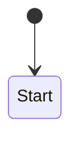

# D04 · 문서 계약

> 대응: FR-2.1~2.5, FR-4.1~4.2, W-11~W-19
> 관련: [00-prd/03 문서 표준](../00-prd/03-document-standards.md) — 양식의 근거

---

## 1. 섹션 앵커 규약

### 1.1 문제와 해법

문서 제목이 사용자 언어를 따르면(`## 3. 범위 밖` vs `## 3. Non-goals`) 제목 문자열로 검증할 수 없다.

**해법**: 각 필수 섹션에 언어 무관 앵커를 심는다.

```markdown
## 3. 범위 밖 (Non-goals)     <!-- tene:sec=nongoals -->
```

검증기는 `<!-- tene:sec=<id> -->` 만 본다. 제목 문자열은 보지 않는다.

**토큰 비용 0**: Claude Code 는 블록 레벨 HTML 주석을 컨텍스트 주입 전에 제거한다.

### 1.2 섹션 ID 표

```javascript
// lib/doc/sections.js
export const SECTIONS = {
  prd: ['background', 'goals', 'nongoals', 'intents', 'uxflow', 'dataflow', 'ac', 'decisions'],
  plan: ['tasks', 'coverage', 'impact', 'order', 'risks', 'notdoing'],
  design: ['overview', 'layers', 'violations', 'logic', 'questions',
           'contracts', 'transitions', 'anchors'],
  'loop-check': ['verdict', 'comparison', 'layercheck', 'unattributed', 'debt', 'fixes', 'notdone'],
  qa: ['gate', 'environment', 'charters', 'acverdicts', 'uxflow', 'dataflow',
       'layers', 'insufficient', 'followup'],
  report: ['summary', 'r1', 'r2', 'r3', 'r4', 'r5', 'r6'],
  'master-plan': ['status', 'goal', 'sprints', 'dependencies', 'constraints', 'carry'],
}

export const AUTO_BLOCKS = {
  prd: [],                                          // 전부 사람이 씀 (인터뷰 결과)
  plan: ['coverage', 'impact'],
  design: ['layers', 'violations', 'questions'],
  'loop-check': ['verdict', 'comparison', 'layercheck', 'unattributed'],
  qa: ['gate', 'environment', 'acverdicts', 'uxflow', 'layers'],
  report: ['summary', 'r2', 'r4', 'r5'],
  'master-plan': ['status', 'carry'],
}
```

### 1.3 자동 생성 블록

```markdown
## 2. Understanding Layer 분류     <!-- tene:sec=layers -->

<!-- tene:auto:start block=layers cia=indexed rules=docs/sprints/_meta/layers.yml -->
### Interface (Entry Point)
| 대상 | 파일 | 신규/수정 | 출처 |
|---|---|---|---|
| `CheckoutPage` | src/pages/CheckoutPage.tsx:12 | 수정 | rules-project |
...
<!-- tene:auto:end -->

### 사람이 쓰는 해석
- 이 계층 배치에서 주의할 점...
```

**규칙**
- `tene:auto:start` ~ `tene:auto:end` 사이만 기계가 교체
- 블록 밖은 **절대 건드리지 않는다**
- 블록이 없으면 해당 섹션 끝에 새로 삽입
- start/end 쌍이 안 맞으면 오류 (교체하지 않음)

---

## 2. 파서

### 2.1 구조

```javascript
// lib/doc/parser.js
/**
 * @typedef {Object} ParsedDoc
 * @property {Object} frontmatter        YAML frontmatter (tene.* 포함)
 * @property {Map<string, Section>} sections   섹션 ID → Section
 * @property {string[]} freeSections     '+@' 로 시작하는 섹션 제목
 * @property {AutoBlock[]} autoBlocks
 * @property {string} raw
 */

/**
 * @typedef {Object} Section
 * @property {string} id
 * @property {string} heading           원본 제목 (언어 무관)
 * @property {number} startLine
 * @property {number} endLine
 * @property {string} body              제목 다음부터 다음 섹션 전까지
 * @property {Table[]} tables           본문의 마크다운 표
 */

export function parseDoc(text) { ... }
```

### 2.2 frontmatter 스키마

```yaml
---
tene:
  sprint: checkout-retry
  doc: prd                      # prd|plan|design|loop-check|qa|report|master-plan
  phase: prd
  status: draft                 # draft | active | done | superseded
  created: 2026-08-18
  modified: 2026-08-20
  lang: ko
  profile: standard
  cia: indexed                  # lsp | indexed | investigated (해당 문서 작성 시)
  supersedes: []
---
```

**파싱 실패 시**: frontmatter 가 없거나 깨지면 검증 실패(`DOC_INVALID`). 자동 복구하지 않는다.

### 2.3 표 파싱

마크다운 표를 구조화한다. 이것이 AC·앵커·판정 추출의 기반이다.

```javascript
/**
 * @typedef {Object} Table
 * @property {string[]} headers
 * @property {string[][]} rows
 * @property {number} startLine
 */

export function parseTables(sectionBody) { ... }
```

**규칙**
- 헤더 구분선(`|---|---|`)이 있어야 표로 인식
- 셀 내 파이프는 `\|` 로 이스케이프
- 셀 앞뒤 공백은 트림
- 빈 행은 건너뜀

### 2.4 플레이스홀더 탐지

템플릿을 채우지 않은 것을 잡는다.

```javascript
const PLACEHOLDER_PATTERNS = [
  /^\s*<[^>]+>\s*$/,          // <기능명>
  /^\s*(TODO|TBD|FIXME)\b/i,
  /^\s*\(작성 필요\)\s*$/,
  /^\s*\.\.\.\s*$/,
  /^\s*-\s*$/,                // 빈 불릿
]

export function isPlaceholderOnly(body) {
  const lines = body.split('\n').map(l => l.trim()).filter(Boolean)
  if (!lines.length) return true
  return lines.every(l => PLACEHOLDER_PATTERNS.some(p => p.test(l)))
}
```

---

## 3. 검증 규칙 (16종)

```javascript
// lib/doc/validate.js
export const RULES = {
  // 구조
  frontmatter:        (d) => hasValidFrontmatter(d),
  sections:           (d, t) => SECTIONS[t].every(id => d.sections.has(id)),
  auto_blocks_paired: (d) => d.autoBlocks.every(b => b.end != null),

  // PRD
  nongoals_nonempty:  (d) => !isPlaceholderOnly(d.sections.get('nongoals').body),
  intent_count:       (d, _, n=1) => tableRows(d, 'intents') >= n,
  ac_count:           (d, _, n=1) => tableRows(d, 'ac') >= n,
  ac_method_tagged:   (d) => acRows(d).every(r => ['UNIT','DATA','UX'].includes(r.method)),
  ac_priority_tagged: (d) => acRows(d).every(r => ['blocking','non-blocking'].includes(r.priority)),
  ac_unwanted_min:    (d, _, n=1) => acRows(d).filter(isUnwantedPattern).length >= n,
  ac_no_vague:        (d) => acRows(d).every(r => !VAGUE_RE.test(r.statement)),

  // Plan
  ac_coverage_full:   (d) => coverageRows(d).every(r => r.status === 'covered'),

  // Design
  layers_all_four:    (d) => LAYER_HEADINGS.every(h => d.sections.get('layers').body.includes(h)),
  questions_present:  (d) => tableCount(d, 'questions') >= 1,
  transitions_present:(d, ctx) => !ctx.hasUxAc || tableRows(d, 'transitions') >= 1,
  anchors_resolved:   (d, ctx) => ctx.acIds.every(id => anchorRows(d).some(r => r.ac === id)),

  // QA
  all_ac_judged:      (d, ctx) => ctx.acIds.every(id => verdictRows(d).some(r => r.ac === id)),
  insufficient_reason:(d) => insufficientRows(d).every(r => r.reason?.trim()),

  // Report
  r1_to_r6_present:   (d) => ['r1','r2','r3','r4','r5','r6']
                              .every(id => d.sections.has(id) && !isPlaceholderOnly(d.sections.get(id).body)),
  r4_all_four:        (d) => LAYER_HEADINGS.every(h => d.sections.get('r4').body.includes(h)),
  r6_reasons:         (d) => carryRows(d).every(r => r.reason?.trim()),
}
```

### 3.1 EARS 패턴 인식

```javascript
const EARS = {
  ubiquitous:  /^\s*시스템은\s|^\s*The system shall\s/i,
  event:       /^\s*\*\*When\*\*|^\s*When\s/i,
  state:       /^\s*\*\*While\*\*|^\s*While\s/i,
  unwanted:    /^\s*\*\*If\*\*|^\s*If\s.*\bthen\b/i,
  optional:    /^\s*\*\*Where\*\*|^\s*Where\s/i,
}

export function isUnwantedPattern(acRow) {
  return EARS.unwanted.test(acRow.statement)
}
```

### 3.2 모호 형용사 목록

```javascript
const VAGUE_RE = /(빠르게|빠른|직관적|적절히|적당히|잘\s|충분히|자연스럽게|깔끔하게|사용자 친화|최적화된|안정적으로|효율적으로)|(quickly|intuitive|appropriately|properly|nicely|smoothly|user-friendly|optimized|robustly)/i
```

**검증 실패 시 메시지**:
```
AC-2 의 "빠르게 응답해야 한다" 는 판정할 수 없습니다.
측정 가능한 형태로 바꾸세요. 예: "3초 이내에 응답해야 한다"
```

### 3.3 자유 섹션 처리

```javascript
// '+@' 로 시작하는 제목은 검증에서 제외
const FREE_SECTION_RE = /^#{1,6}\s*\+@\s+/

// 파싱 시 freeSections 로 분리하고 sections 에 넣지 않는다
```

---

## 4. 템플릿

### 4.1 PRD 템플릿 (ko)

```markdown
---
tene:
  sprint: {{sprint}}
  doc: prd
  phase: prd
  status: draft
  created: {{today}}
  modified: {{today}}
  lang: ko
  profile: {{profile}}
---

# {{title}} — PRD

## 1. 배경과 문제     <!-- tene:sec=background -->

<작성 필요>

## 2. 목표     <!-- tene:sec=goals -->

<작성 필요>

## 3. 범위 밖 (Non-goals)     <!-- tene:sec=nongoals -->

> ⚠️ 필수. 비어 있으면 G1 게이트 실패. "없음" 이라도 명시적으로 적습니다.

<작성 필요>

## 4. 기획 의도 (Intent)     <!-- tene:sec=intents -->

| ID | 의도 | 근거 | 행위자 | 출처 |
|---|---|---|---|---|
| intent_1 | <무엇을 달성하려는가> | <왜> | <누가> | conversation |

## 5. 사용자 흐름 (UX Flow)     <!-- tene:sec=uxflow -->

### 정상 경로
<작성 필요>

### 실패 경로
- 어디서 실패하고 어디로 가는가

### 되돌아오는 경로
- 뒤로가기 / 새로고침 / 중복 제출 / 재시도



## 6. 데이터 처리 흐름     <!-- tene:sec=dataflow -->

- 입력이 어디서 발생해 어디에 남는가
- 실패 시 데이터는 어떻게 되는가 (롤백 / 부분기록 / 미기록)

## 7. 수용 기준 (AC)     <!-- tene:sec=ac -->

| ID | 기준 (EARS) | 우선도 | 방식 | 앵커 | 상태 |
|---|---|---|---|---|---|
| ac_1 | **When** … , 시스템은 … 해야 한다 | blocking | UX | (design 에서) | pending |
| ac_2 | **If** … , **then** 시스템은 … 해야 한다 | blocking | DATA | | pending |

> 규칙: EARS 5패턴만 / 하나의 AC 는 하나의 판정 / If-then 최소 1개 / 모호 형용사 금지

## 8. 열린 결정 사항     <!-- tene:sec=decisions -->

| # | 결정할 것 | 선택지 | 기본 제안 | 결정자 |
|---|---|---|---|---|

## +@ (자유 관점)
```

### 4.2 QA 템플릿 (핵심 부분)

```markdown
## 1. 게이트 판정     <!-- tene:sec=gate -->

<!-- tene:auto:start block=gate -->
| 항목 | 값 |
|---|---|
| blocking AC | 3 (passed 2 / failed 1) |
| non-blocking AC | 2 (passed 1 / insufficient 1) |
| stale | 0 |
| **게이트 G6** | ❌ **FAIL** |
| 전이 커버리지 | 3 / 5 (60%) |
<!-- tene:auto:end -->

> 게이트 규칙: blocking AC 전부 `passed` + evidence 유효 + stale 0.
> `insufficient` 는 게이트를 막지 않으나 report R6 에 반드시 기록됩니다.

## 2. 검증 환경     <!-- tene:sec=environment -->

<!-- tene:auto:start block=environment -->
| 도구 | 가용 | 비고 |
|---|---|---|
| 테스트 러너 | ✅ vitest 3.1.0 | |
| 브라우저 | ✅ playwright | Chrome MCP 미연결 |
| 코드 지능 | ⚠️ indexed | LSP 미설치 |
| DB 관찰 | ⛔ 없음 | L3 일부 insufficient |
<!-- tene:auto:end -->

## 3. Test Charter     <!-- tene:sec=charters -->

| ID | AC | 행위자 | 변형 | 필요 레이어 | 위험 |
|---|---|---|---|---|---|
| charter_1 | ac_1 | 구매자 | happy, error, retry | L2, L5 | high |

## 4. AC 별 판정     <!-- tene:sec=acverdicts -->

<!-- tene:auto:start block=acverdicts -->
| AC | 우선도 | 방식 | 판정 | 증거 | 반박 검증 |
|---|---|---|---|---|---|
| ac_1 | blocking | UX | ✅ passed | `evidence/run_.../ac_1.gif` | 3/3 반박 실패 (유지) |
| ac_2 | blocking | DATA | ❌ failed | `evidence/run_.../ac_2.json` | — |
| ac_3 | non-blocking | UX | ⬜ insufficient | — | — |
<!-- tene:auto:end -->

## 5. UX 흐름 검증     <!-- tene:sec=uxflow -->

<!-- tene:auto:start block=uxflow -->
### 5.1 전이 커버리지
| 엣지 | 측정 | 결과 | 증거 |
|---|---|---|---|
| CheckoutPage → Processing | ✅ | 정상 | evidence/.../e1.png |
| Processing → CheckoutPage (4xx) | ✅ | 입력값 보존 확인 | evidence/.../e2.gif |
| Processing → ErrorPage (5xx) | ⬜ | 미측정 | — |

### 5.2 되돌아오는 경로
| 시나리오 | 결과 |
|---|---|
| 뒤로가기 후 상태 보존 | ✅ |
| 새로고침 후 복구 | ❌ 입력값 소실 |
| 중복 제출 방지 | ⬜ 미측정 |
| 실패 후 재시도 | ✅ |
<!-- tene:auto:end -->

## 6. 데이터 처리 흐름 검증     <!-- tene:sec=dataflow -->

| 검증 | 정적 확인 | 동적 확인 | 교차 판정 |
|---|---|---|---|
| AC-2 실패 기록 | markFailed 호출 없음 (indexed) | payments 에 기록 없음 | **failed (미구현)** |

## 7. 7-Layer 처리     <!-- tene:sec=layers -->

<!-- tene:auto:start block=layers -->
| Layer | 처리 | 사유 |
|---|---|---|
| L1 Static | required ✅ | eslint + tsc 통과 |
| L2 Unit/Contract | required ✅ | 12/12 |
| L3 Integration/Data | required ❌ | AC-2 실패 |
| L4 System E2E | not-applicable | 단일 서비스, 시스템 경로 없음 |
| L5 Intent/UX | required ⚠️ | 3/5 엣지 |
| L6 Adversarial/Recovery | **required — 미해결** | 실행되지 않음 |
| L7 Regression/Drift | not-applicable | 신규 기능, 기준선 없음 |
<!-- tene:auto:end -->

## 8. 미측정 항목     <!-- tene:sec=insufficient -->

| 항목 | 사유 | 측정하려면 |
|---|---|---|
| ac_3 | 타임아웃 재현 환경 부재 | 목 서버에 지연 주입 필요 |
| Processing → ErrorPage | 5xx 재현 불가 | 동일 |

> ⚠️ 미측정을 0% 또는 passed 로 표기하지 않습니다.

## 9. 후속 조치     <!-- tene:sec=followup -->

| # | 조치 | 대상 | 우선순위 |
|---|---|---|---|

## +@ (자유 관점)
```

### 4.3 다국어 템플릿

`templates/<doc>.template.<lang>.md` 로 언어별 파일을 둔다.

| 언어 | 파일 | 차이 |
|---|---|---|
| ko | `prd.template.ko.md` | 제목·설명이 한국어 |
| en | `prd.template.en.md` | 제목·설명이 영어 |

**앵커 ID 는 동일**하므로 검증 코드는 하나다.

언어 선택:
```
project.json 의 docLanguage → userConfig.doc_language → 세션 언어 감지 → 'en'
```

---

## 5. 스캐폴드 생성

```javascript
// lib/doc/template.js
export function scaffold(docType, ctx) {
  const lang = ctx.lang ?? 'en'
  const tpl = readTemplate(docType, lang)
  return render(tpl, {
    sprint: ctx.sprintId,
    title: ctx.title,
    today: todayIso(),
    profile: ctx.profile,
  })
}
```

**치환 변수**: `{{sprint}}`, `{{title}}`, `{{today}}`, `{{profile}}` 만. 복잡한 템플릿 엔진을 만들지 않는다.

### 5.1 기존 파일 보호

```
scaffold 대상 파일이 이미 존재하면:
  · 내용이 템플릿과 동일(플레이스홀더만)  → 덮어쓴다
  · 내용이 수정되어 있음                  → 덮어쓰지 않고 오류
                                            "이미 작성된 문서가 있습니다. 
                                             누락 섹션만 추가하려면 --merge 를 쓰세요"
```

`--merge`: 누락된 섹션 앵커만 문서 끝에 추가한다. 기존 내용은 건드리지 않는다.

---

## 6. Patch — 자동 블록 교체

```javascript
// lib/doc/patch.js
export function patchBlock(docText, blockName, newContent, meta = {}) {
  const startRe = new RegExp(`<!--\\s*tene:auto:start\\s+block=${blockName}\\b[^>]*-->`)
  const endMarker = '<!-- tene:auto:end -->'

  const startMatch = docText.match(startRe)
  if (!startMatch) return insertBlockAtSection(docText, blockName, newContent, meta)

  const startIdx = startMatch.index
  const endIdx = docText.indexOf(endMarker, startIdx)
  if (endIdx === -1) throw new TeneError('AUTO_BLOCK_UNPAIRED', { block: blockName })

  const header = `<!-- tene:auto:start block=${blockName}${formatMeta(meta)} -->`
  return docText.slice(0, startIdx) +
         header + '\n' + newContent.trimEnd() + '\n' + endMarker +
         docText.slice(endIdx + endMarker.length)
}
```

### 6.1 안전 규칙

| 규칙 | 이유 |
|---|---|
| start/end 쌍이 안 맞으면 **오류** (부분 교체 금지) | 문서가 깨진다 |
| 블록 밖 내용은 바이트 단위로 보존 | 사람이 쓴 것을 잃지 않는다 |
| 블록이 없으면 해당 섹션 **끝**에 삽입 | 섹션 제목 바로 뒤가 아니라 끝 (사람 서술 뒤) |
| 쓰기는 `writeAtomic` 경유 | 부분 쓰기 방지 |

### 6.2 메타 정보

```markdown
<!-- tene:auto:start block=layers cia=indexed rules=docs/sprints/_meta/layers.yml generated=2026-08-20T04:20:00Z -->
```

블록 헤더에 **어떤 근거로 생성되었는지** 남긴다. 나중에 신뢰도를 판단할 수 있다.

---

## 7. Extract — 문서 → 구조화 데이터

스킬·에이전트가 문서를 직접 파싱하지 않게 한다. 파싱 로직을 한 곳에 모은다.

```bash
tene-doc extract --sprint <id> --what ac|intents|tasks|coverage|edges|anchors|verdicts|requirements|carry
```

### 7.1 `--what ac`

```jsonc
{ "ok": true, "data": { "ac": [
  { "id": "ac_1", "intentId": "intent_1",
    "statement": "If 카드가 만료되었다면, then 시스템은 결제 화면으로 복귀하고 입력값을 보존해야 한다",
    "pattern": "unwanted", "priority": "blocking", "method": "UX",
    "anchors": ["CheckoutPage"], "status": "pending",
    "sourceLine": 87 }
]}}
```

### 7.2 `--what requirements` (loop-check 용)

6개 출처에서 요구 항목을 모은다.

```jsonc
{ "ok": true, "data": { "requirements": [
  { "id": "req_1", "source": "prd:ac", "refId": "ac_1",
    "statement": "…", "priority": "blocking" },
  { "id": "req_2", "source": "plan:task", "refId": "task_1",
    "statement": "결제 실패 응답 처리", "coversAc": ["ac_2"] },
  { "id": "req_3", "source": "design:logic", "refId": "4.1",
    "statement": "3초 타임아웃 분기" },
  { "id": "req_4", "source": "design:layer", "refId": "persistence",
    "statement": "paymentsRepo.markFailed 신규" },
  { "id": "req_5", "source": "design:transition", "refId": "edge_2",
    "statement": "Processing → CheckoutPage (4xx)" },
  { "id": "req_6", "source": "design:contract", "refId": "POST /api/v1/payments",
    "statement": "응답에 reason 필드 포함" }
]}}
```

### 7.3 `--what anchors`

```jsonc
{ "ok": true, "data": { "anchors": {
  "ac_1": [{ "kind": "screen", "value": "CheckoutPage", "file": "src/pages/CheckoutPage.tsx" }],
  "ac_2": [{ "kind": "symbol", "value": "processPayment", "file": "src/payments/processPayment.ts" },
           { "kind": "symbol", "value": "paymentsRepo.markFailed", "file": "src/db/payments.ts" }]
}}}
```

---

## 8. 검증 출력

```bash
tene-doc validate --sprint checkout-retry --doc prd
```

```jsonc
{ "ok": true, "data": {
  "doc": "docs/sprints/checkout-retry-.../00-prd/prd.md",
  "type": "prd", "lang": "ko", "valid": false,
  "checks": [
    { "id": "frontmatter",       "pass": true },
    { "id": "sections",          "pass": true },
    { "id": "nongoals_nonempty", "pass": false,
      "detail": "§3 범위 밖이 플레이스홀더만 포함합니다",
      "line": 23 },
    { "id": "intent_count",      "pass": true, "value": 1 },
    { "id": "ac_count",          "pass": true, "value": 3 },
    { "id": "ac_method_tagged",  "pass": true },
    { "id": "ac_priority_tagged","pass": true },
    { "id": "ac_unwanted_min",   "pass": false,
      "detail": "If-then 패턴 AC 가 없습니다. 실패 조건 기준을 최소 1개 추가하세요" },
    { "id": "ac_no_vague",       "pass": false,
      "detail": "ac_2 의 '빠르게' 는 판정할 수 없습니다",
      "line": 91, "suggestion": "측정 가능한 수치로 바꾸세요. 예: '3초 이내'" }
  ],
  "freeSections": ["+@ 참고 자료"],
  "gate": "G1", "gateResult": "fail"
}}
```

**`--strict`**: 경고(warning)도 실패로 취급. CI 용.

---

## 9. 문서 언어 결정 흐름

```
1. docs/sprints/_meta/project.json 의 docLanguage 가 있으면 → 그것
2. userConfig.doc_language 가 'auto' 가 아니면 → 그것
3. 세션의 사용자 언어 감지 (첫 사용자 메시지의 문자 분포)
4. 기본값 'en'

→ 최초 sprint 생성 시 확정하고 project.json 에 기록. 이후 고정.
```

**고정하는 이유**: 같은 프로젝트에 한국어 문서와 영어 문서가 섞이면 팀이 읽기 어렵다. 바꾸려면 명시적으로 `_meta/project.json` 을 편집한다.

---

## 10. 문서 무결성 검사

`/tene:doctor` 가 수행하는 문서 층 점검.

| 검사 | 내용 |
|---|---|
| 고아 문서 | `docs/sprints/` 에 있는데 상태에 없는 sprint |
| 유령 상태 | 상태에 있는데 문서가 없는 sprint |
| 앵커 쌍 불일치 | `tene:auto:start` 와 `end` 개수 불일치 |
| frontmatter 누락 | `tene:` 블록이 없는 sprint 문서 |
| 언어 혼재 | 같은 sprint 안에 다른 lang frontmatter |
| 표 파싱 실패 | AC/앵커/판정 표를 읽을 수 없음 |

```
[tene:doctor] 문서 점검
  ✅ sprint 3개, 문서 14개
  ⚠️ 고아 문서 1건: docs/sprints/old-feature-x/ (상태 없음)
     → /tene:sprint status old-feature --resync 로 복구하거나 아카이브하세요
  ❌ 앵커 쌍 불일치: checkout-retry/02-design/design.md:142
     → tene:auto:end 가 없습니다. 수동 수정이 필요합니다
```
