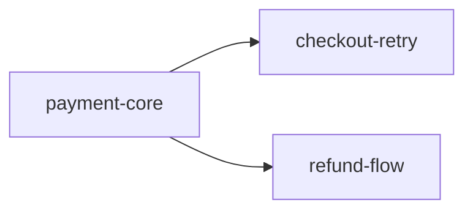

# D10 · Report · 집계

> 대응: FR-2.4 (report R1~R6), FR-1.5 (master plan), W-61~W-6B
> 사용자 요구: report 6항목 — 이 제품의 회고·방어 장치

---

## 0. R1~R6 의 역할

| # | 항목 | 방어하는 실패 |
|---|---|---|
| R1 | 이전 sprint 와 어떻게 이어지는가 | **고립된 기능, 중복 구현, 고아 코드** |
| R2 | 어떤 파일을 생성·수정했고 무엇을 구현했나 | 변경 범위 파악 실패 |
| R3 | 어떤 기획 의도를 충족시키기 위한 것인가 | **의도와 구현의 단절** |
| R4 | Understanding Layer 4계층 작업 내역 | **숲을 못 봄 — 계층 쏠림·위반** |
| R5 | 6가지 질문 답변 | **나무를 못 봄 — 단편적 판단** |
| R6 | 결정 대기·이월과 사유 | **조용히 사라지는 미결 항목** |

**R4·R5 가 이 제품의 기술부채 방어 본체다.**

---

## 1. R1 — 이전 sprint 와의 연결

### 1.1 알고리즘

```javascript
// lib/report/lineage.js
export function buildLineage(sprint, masterPlan, index, anchors) {
  // 1. 대상 이전 sprint 선정
  const predecessors = [
    ...(masterPlan.sprints.find(s => s.id === sprint.id)?.dependsOn ?? []),
    ...recentArchived(masterPlan, 3),          // 시간순 직전 3개
  ]
  const uniq = [...new Set(predecessors)]

  // 2. 각 이전 sprint 의 산출 심볼 수집
  const prevSymbols = new Map()                // symbol → sprintId
  for (const pid of uniq) {
    const report = readReport(pid)
    if (!report) continue
    for (const sym of extractProducedSymbols(report)) prevSymbols.set(sym, pid)
  }

  // 3. 이번 sprint 의 변경 심볼
  const changed = changedSymbols(sprint, index)

  // 4. 관계 분류
  const relations = []
  for (const [sym, pid] of prevSymbols) {
    if (changed.has(sym)) {
      relations.push({ kind: 'modified', symbol: sym, from: pid,
                       detail: '이번 sprint 에서 직접 수정' })
      continue
    }
    const refs = index.refs[sym] ?? []
    const refFromChanged = refs.filter(r => changed.hasFile(r.file))
    if (refFromChanged.length) {
      relations.push({ kind: 'extended', symbol: sym, from: pid,
                       detail: `이번 변경이 참조: ${refFromChanged.map(r => `${r.file}:${r.line}`).join(', ')}`,
                       source: 'indexed' })
      continue
    }
    // 5. 연결 끊김 후보
    if (refs.length === 0) {
      relations.push({ kind: 'orphaned', symbol: sym, from: pid,
                       detail: '참조 0건 — 이번 변경으로 사용되지 않게 되었을 수 있음',
                       confidence: 'medium' })
    }
  }
  return relations
}
```

### 1.2 `orphaned` 가 R1 의 진짜 가치

이전 sprint 산출물이 **이번 변경으로 고아가 되는 것**을 잡는다.

```
R1. 이전 sprint 와의 연결

| 이전 sprint | 산출물 | 관계 | 근거 |
|---|---|---|---|
| payment-core | `processPayment` | 확장 — 실패 분기 추가 | indexed (src/payments/processPayment.ts:42) |
| checkout-ui | `CheckoutPage` | 직접 수정 | git diff |

### 연결이 끊긴 지점
| 산출물 | 출처 sprint | 현재 참조 | 판단 필요 |
|---|---|---|---|
| `legacyPaymentHandler` | payment-core | **0건** | 이번 변경으로 대체되었다면 삭제 대상입니다 |
```

**`orphaned` 는 확정이 아니라 후보다.** 사람이 판단한다. 동적 디스패치로 호출될 수 있으므로 `confidence: medium`.

### 1.3 산출 심볼 추출

```javascript
function extractProducedSymbols(reportDoc) {
  // R2 표의 "변경" 열이 "신규" 인 행의 심볼
  const r2 = reportDoc.sections.get('r2')
  return parseTables(r2.body)
    .flatMap(t => t.rows)
    .filter(r => r.change?.includes('신규') || r.change?.includes('new'))
    .flatMap(r => r.symbols?.split(',').map(s => s.trim()) ?? [])
}
```

**R2 가 R1 의 입력이 된다.** 그래서 R2 의 심볼 기록이 정확해야 한다.

---

## 2. R2 — 파일 변경과 구현 내용

### 2.1 알고리즘

```javascript
// lib/report/changes.js
export function buildChanges(sprint, index, rules) {
  const stat = gitDiffStat(sprint.startCommit, 'HEAD')   // path, added, removed
  const rows = []

  for (const f of stat) {
    if (isDocOrState(f.path)) continue
    const layer = judgeLayer(f.path, index, rules)
    const symbols = changedSymbolsInFile(f.path, sprint.startCommit)
    rows.push({
      path: f.path,
      change: f.added > 0 && f.removed === 0 && isNewFile(f.path) ? '신규' : '수정',
      diff: `+${f.added}/-${f.removed}`,
      layer: layer.layer ?? '미분류',
      layerSource: layer.source,
      symbols,
    })
  }
  return rows.sort(byLayerOrder)
}
```

### 2.2 심볼 diff

```javascript
function changedSymbolsInFile(path, baseCommit) {
  const before = gitShow(`${baseCommit}:${path}`)         // 없으면 신규 파일
  const after = readFileSync(path, 'utf8')
  const pack = langPackFor(path)
  if (!pack) return []

  const defsBefore = new Set(pack.extractDefinitions(pack.stripNonCode(before ?? '')).map(d => d.name))
  const defsAfter = pack.extractDefinitions(pack.stripNonCode(after))

  return defsAfter.map(d => ({
    name: d.name,
    kind: d.kind,
    status: defsBefore.has(d.name) ? 'modified' : 'added',
  })).concat(
    [...defsBefore].filter(n => !defsAfter.some(d => d.name === n))
      .map(n => ({ name: n, status: 'removed' }))
  )
}
```

**삭제된 심볼도 기록한다.** R1 의 `orphaned` 판정과 짝을 이룬다.

### 2.3 구현 내용 서술

표는 기계가 만들고, **"어떻게 구현했는지"는 LLM 이 diff 를 읽고 쓴다.**

```markdown
<!-- tene:auto:start block=r2 source=git+rules -->
| 파일 | 변경 | 계층 | 심볼 |
|---|---|---|---|
| `src/payments/processPayment.ts` | 수정 +42/-8 | business-logic | processPayment (modified) |
| `src/db/payments.ts` | 수정 +15/-0 | persistence | markFailed (added) |
| `src/pages/CheckoutPage.tsx` | 수정 +30/-5 | interface | CheckoutPage (modified) |
<!-- tene:auto:end -->

### 구현 내용
- `processPayment`: PG 응답이 4xx 일 때 `markFailed` 를 호출하고 실패 사유를 응답에 포함하도록 분기 추가
- `markFailed`: `payments` 행의 status 를 'failed' 로 갱신하고 reason 을 기록. 신규
- `CheckoutPage`: 402 응답 시 폼 상태를 복원하고 사유를 표시
```

---

## 3. R3 — 기획 의도 충족 매핑

### 3.1 알고리즘

```javascript
// lib/report/intent-map.js
export function buildIntentMap(sprint, prdDoc, anchors) {
  const intents = extractIntents(prdDoc)
  const acs = extractAcTable(prdDoc)
  const rows = []

  for (const ac of acs) {
    const intent = intents.find(i => i.id === ac.intentId)
    const acAnchors = anchors.byAc[`${sprint.id}:${ac.id}`]?.anchors ?? []
    rows.push({
      implementation: acAnchors.map(a => a.value).join(', '),
      acId: ac.id,
      acStatement: ac.statement,
      intentId: intent?.id,
      intentStatement: intent?.statement,
      rationale: intent?.rationale,
      verdict: sprint.ac.find(a => a.id === ac.id)?.verdict,
    })
  }
  return rows
}
```

### 3.2 "의도와 다르게 구현된 것"

loop-check 문서의 `partial`/`mismatch` 판정 중, **구현은 되었으나 설계와 다른 것**을 수집한다.

```javascript
export function findDeviations(loopCheckDocs) {
  const latest = loopCheckDocs[loopCheckDocs.length - 1]
  return parseTables(latest.sections.get('comparison').body)
    .flatMap(t => t.rows)
    .filter(r => r.judgment === 'partial' || r.kind === 'mismatch')
    .map(r => ({ requirement: r.requirement, actual: r.evidence, gap: r.detail }))
}
```

```markdown
### 의도와 다르게 구현된 것
| 요구 | 실제 구현 | 승인 여부 |
|---|---|---|
| 3초 타임아웃 (design §4.1) | 5초로 하드코딩 | ⚠️ 미승인 — R6 로 이월 |
```

**미승인 편차는 반드시 R6 으로 이월된다.** 조용히 넘어가지 않는다.

---

## 4. R4 — Understanding Layer

### 4.1 생성

```javascript
// lib/report/layers-questions.js
export function buildLayerSection(sprint, index, rules) {
  const changed = gitDiffNames(sprint.startCommit, 'HEAD')
  const byLayer = { interface: [], 'business-logic': [], persistence: [],
                    infrastructure: [], unclassified: [] }

  for (const path of changed) {
    if (isDocOrState(path)) continue
    const l = judgeLayer(path, index, rules)
    const key = l.layer ?? 'unclassified'
    byLayer[key].push({
      path, symbols: changedSymbolsInFile(path, sprint.startCommit),
      source: l.source, reason: l.reason, suggestion: l.suggestion,
    })
  }
  return byLayer
}
```

### 4.2 출력 (4계층 전부 필수)

```markdown
<!-- tene:auto:start block=r4 rules=docs/sprints/_meta/layers.yml -->
### Interface (Entry Point)
- `CheckoutPage` — 실패 응답 처리 분기 추가 (src/pages/CheckoutPage.tsx:88) · rules-project

### Business Logic (Processing rules)
- `processPayment` — 4xx 분기 확장 (src/payments/processPayment.ts:42) · rules-project

### Persistence (Data)
- `paymentsRepo.markFailed` — 신규 (src/db/payments.ts:45) · rules-project

### Infrastructure (Runtime)
- 해당 없음

### 미분류
- 해당 없음
<!-- tene:auto:end -->
```

**"해당 없음" 도 명시한다.** 빈 채로 두면 G7 fail.

### 4.3 계층 균형 평가 (사람/LLM 서술)

```markdown
### 계층 균형 평가
이번 sprint 는 3개 계층에 고르게 분포했습니다. Infrastructure 무변경은
기능 추가 성격상 타당합니다.

⚠️ 주의: Persistence 변경이 신규 함수 1개뿐입니다. 실패 기록에 인덱스나
마이그레이션이 필요한지 확인이 필요합니다 (R6 D2 로 이월).
```

**쏠림 판단 기준**

| 패턴 | 해석 |
|---|---|
| 한 계층에만 집중 | 정상일 수 있음 (UI 개선, 리팩터링) |
| interface 만 변경인데 데이터 AC 존재 | **의심** — 영속화가 빠졌을 가능성 |
| persistence 만 변경인데 UX AC 존재 | **의심** — 화면 연결이 빠졌을 가능성 |
| 미분류가 30% 이상 | 계층 규칙 보완 필요 |

---

## 5. R5 — 6가지 질문

### 5.1 대상 선정

```javascript
export function selectQuestionTargets(sprint, index, anchors, limit = 20) {
  const changed = changedSymbols(sprint, index)
  const anchored = new Set(Object.values(anchors.byAc).flatMap(a => a.anchors.map(x => x.value)))

  const scored = [...changed].map(sym => ({
    sym,
    score:
      (anchored.has(sym) ? 100 : 0) +                              // AC 앵커 우선
      (layerOf(sym) === 'business-logic' ? 30 : 0) +
      (layerOf(sym) === 'persistence' ? 30 : 0) +
      (index.refs[sym]?.length ?? 0),                              // 참조 많을수록
  }))

  scored.sort((a, b) => b.score - a.score)
  return {
    selected: scored.slice(0, limit).map(s => s.sym),
    omitted: scored.slice(limit).map(s => s.sym),
  }
}
```

### 5.2 상한 20의 이유

**100개 심볼의 6질문 표는 아무도 읽지 않는다.** 읽히지 않는 문서는 방어 장치가 아니다.

```markdown
<!-- tene:auto:start block=r5 cia=indexed -->
### `processPayment`
| 질문 | 답변 | 출처 |
|---|---|---|
| 선언·정의된 이름 | `processPayment` (function) | indexed |
| 정의 파일 | `src/payments/processPayment.ts:42` | indexed |
| import·참조 위치 | `src/api/routes/payments.ts:3`, `src/jobs/retry.ts:2` | indexed |
| 호출·사용 위치 | `POST /api/v1/payments` ← `CheckoutPage.onSubmit`, `retryJob.run` | indexed (medium) |
| 입력 데이터 | `{ amount: number; cardToken: string; idempotencyKey?: string }` | indexed |
| 반환·변경 데이터 | `Promise<PaymentResult>` · `payments` UPDATE (markFailed 경유) | indexed+heuristic |

### `paymentsRepo.markFailed`
| … | … | … |

> 그 외 7개 심볼의 6질문은 [questions-full.md](./questions-full.md) 에 있습니다.
<!-- tene:auto:end -->
```

### 5.3 "이 답변에서 드러난 것" (핵심)

**표는 기계가 만들고, 해석은 LLM 이 쓴다.** 이 해석이 R5 의 실제 가치다.

```markdown
### 이 답변에서 드러난 것
- `processPayment` 의 호출자에 `retryJob.run` 이 있습니다. **설계 단계에 없던 경로입니다.**
  재시도 잡이 같은 함수를 호출하므로, `idempotencyKey` 를 전달하지 않으면 중복 결제
  위험이 있습니다. → R6 D1 로 이월

- `markFailed` 의 참조가 1건뿐입니다. 예상대로 `processPayment` 에서만 호출됩니다.

- `CheckoutPage` 의 참조에 `src/db/payments` 가 있습니다. **interface → persistence
  직접 참조(계층 위반)** 입니다. loop-check 에서 debt 로 기록되었습니다.
```

**이 세 발견이 전부 6질문 표에서 나왔다.** 이것이 단편적 판단을 막는 방식이다.

---

## 6. R6 — 결정 대기·이월

### 6.1 수집 출처 (5곳)

```javascript
// lib/report/carry.js
export function collectCarryOver(sprint, docs) {
  return [
    // 1. 상태의 carryOver (design 6질문 발견, loop-check 잔여 등)
    ...sprint.carryOver,

    // 2. QA insufficient
    ...sprint.ac.filter(a => a.verdict === 'insufficient').map(a => ({
      id: `C-${a.id}`, kind: 'deferred',
      title: `${a.id} 검증 (${a.method})`,
      reason: a.reason, toMeasure: a.toMeasure,
    })),

    // 3. PRD 미해결 열린 결정
    ...extractOpenDecisions(docs.prd).map(d => ({
      id: `D-${d.n}`, kind: 'decision',
      title: d.question, options: d.options, reason: '결정되지 않음',
    })),

    // 4. Waiver 승인 항목
    ...sprint.waivers.filter(w => w.status === 'approved').map(w => ({
      id: `W-${w.waiver_id}`, kind: 'waived',
      title: `${w.target_id} 예외 승인`, reason: w.reason, expiresAt: w.expires_at,
    })),

    // 5. 미승인 편차 (R3)
    ...findDeviations(docs.loopCheck).filter(d => !d.approved).map(d => ({
      id: `V-${d.requirement}`, kind: 'decision',
      title: `${d.requirement} 편차`, reason: d.gap,
    })),
  ]
}
```

### 6.2 출력

```markdown
## R6. 사용자 결정 대기 · 이월 작업     <!-- tene:sec=r6 -->

### 결정이 필요한 정책
| # | 결정할 것 | 선택지 | 영향 | 왜 지금 정해야 하나 |
|---|---|---|---|---|
| D1 | 재시도 잡의 멱등키 정책 | (a) 원 결제와 동일 키 (b) 새 키 | 중복 결제 위험 | R5 에서 발견된 미설계 호출 경로 |
| D2 | payments 실패 기록의 인덱스 | (a) status 인덱스 추가 (b) 유지 | 조회 성능 | R4 계층 균형 평가에서 제기 |

### 이월 작업
| # | 작업 | 왜 이번에 하지 않았나 | 언제 할 것인가 |
|---|---|---|---|
| C-ac_3 | 타임아웃 시나리오 검증 (UX) | 지연 주입 도구가 없어 재현 불가 | 목 서버 도입 후 |
| C1 | 5xx → ErrorPage 전이 검증 | 5xx 재현 환경 부재 | 동일 |

### 예외 승인 (waiver)
| # | 대상 | 사유 | 만료 |
|---|---|---|---|
| W-1 | L6 (Adversarial/Recovery) | 결함 주입 도구 미도입 | 없음 |
```

### 6.3 G7 검사

```
r6_reasons_present: 각 항목에 reason 이 비어있지 않은가
```

**사유 없는 이월은 게이트를 통과하지 못한다.** 이것이 "조용히 사라짐"을 막는 최종 방어선이다.

---

## 7. `tene-reporter` 에이전트

```yaml
---
name: tene-reporter
description: sprint 회고 문서(R1~R6)를 작성한다.
tools: Read, Glob, Grep, Bash, Write
model: inherit
---
```

```
당신은 sprint 회고 문서를 작성한다.

자동 생성 영역 (사실 — bin/ 스크립트 결과를 렌더링):
  R1 이전 sprint 연결 관계 표
  R2 파일 변경 표
  R4 4계층 작업 내역
  R5 6질문 표

해석 영역 (판단 — 당신이 쓴다):
  R1 "연결이 끊긴 지점" 의 의미
  R2 "구현 내용" 서술 (diff 를 읽고)
  R3 의도 매핑과 "의도와 다르게 구현된 것"
  R4 "계층 균형 평가"
  R5 "이 답변에서 드러난 것"   ← 가장 중요
  R6 정리와 우선순위

R5 해석 작성 지침:
· 6질문 결과에서 설계에 없던 참조·호출 경로를 찾아라
· 참조 0건인 심볼(orphan)을 지적하라
· 계층 위반을 지적하라
· 발견한 위험은 반드시 R6 으로 이월하라

금지:
· R1~R6 중 어느 것도 비워두지 마라. 없으면 "해당 없음" 이라고 쓰되 빈칸은 안 된다
· 이월 항목에 사유 없이 두지 마라
· 자동 생성 영역을 손으로 편집하지 마라
· 사실과 해석을 섞지 마라

반환: { docPath, r1..r6Present: boolean, carryOverCount, findings[] }
```

---

## 8. Master Plan 집계

### 8.1 문서

```markdown
# Sprint Master Plan

## 0. 현황     <!-- tene:sec=status -->

<!-- tene:auto:start block=status -->
| Sprint | 상태 | Phase | blocking AC | QA | 기간 |
|---|---|---|---|---|---|
| payment-core | archived | — | 4/4 passed | pass | 08-10 ~ 08-14 |
| checkout-retry | active | qa | 2/3 passed | **fail** | 08-18 ~ |
| refund-flow | planned | — | — | — | — |
<!-- tene:auto:end -->

## 1. 목표     <!-- tene:sec=goal -->
결제 실패로 인한 이탈률을 절반으로 줄인다

## 2. Sprint 목록과 순서     <!-- tene:sec=sprints -->
| # | Sprint | 목표 | 선행 |
|---|---|---|---|
| 1 | payment-core | 결제 코어 | — |
| 2 | checkout-retry | 실패 시 입력값 보존 | payment-core |
| 3 | refund-flow | 환불 흐름 | payment-core |

## 3. 의존     <!-- tene:sec=dependencies -->


## 4. 공통 제약     <!-- tene:sec=constraints -->
- PG사 응답 지연 3초 가정
- 모바일 우선

## 5. 이월·미결 집계     <!-- tene:sec=carry -->

<!-- tene:auto:start block=carry -->
| 출처 | # | 종류 | 항목 | 상태 | 차단 대상 |
|---|---|---|---|---|---|
| checkout-retry | D1 | decision | 재시도 잡의 멱등키 정책 | open | refund-flow |
| checkout-retry | C1 | deferred | 5xx → ErrorPage 전이 검증 | open | — |
| checkout-retry | W-1 | waived | L6 예외 승인 | open | — |
<!-- tene:auto:end -->

## +@ (자유)
```

### 8.2 `--next` 출력

```
[tene:master-plan] 다음 추천 sprint

  refund-flow (선행 payment-core 완료)

⚠️ 시작 전 결정이 필요합니다:
  D1  재시도 잡의 멱등키 정책 (checkout-retry 에서 이월)
      (a) 원 결제와 동일 키  (b) 새 키
      → 이 결정 없이 시작하면 design 단계에서 막힙니다

이월 작업 중 이 sprint 와 관련된 것:
  (없음)

시작하려면: /tene:sprint init refund-flow
```

### 8.3 이월 항목의 새 sprint 흡수

```
/tene:sprint init timeout-handling
  → PRD 인터뷰 시작 시:

[tene] master plan 에 이 영역과 관련된 이월 항목이 있습니다:

  C1   5xx → ErrorPage 전이 검증 (from: checkout-retry)
       사유: 5xx 재현 환경 부재
  C-ac_3  타임아웃 시나리오 검증 (from: checkout-retry)
       사유: 지연 주입 도구 없음

이번 sprint 에 포함할까요?
  → 채택 시 이 sprint 의 AC 로 승격되고, master plan 의 항목은 status: adopted 로 갱신됩니다
```

**이 흐름이 R6 → master plan → 다음 sprint PRD 의 순환을 완성한다.** 한 번 적힌 미결 항목은 해결되거나 사유와 함께 폐기되기 전까지 계속 눈에 띈다.

### 8.4 폐기 처리

```
/tene:master-plan --carry --resolve C1 --discard --reason "요구가 철회됨"
```

**폐기에도 사유를 요구한다.** 사유 없는 폐기는 "조용히 사라짐"과 같다.

---

## 9. 아카이브

```javascript
// /tene:archive 로직
async function archive(sprintId) {
  const sprint = loadSprint(sprintId)

  // 1. G7 확인
  const gate = evaluateGate(sprint, 'G7')
  if (gate.result === 'fail') return { blocked: gate.findings }

  // 2. carryOver 를 master plan 으로 승격
  const plan = promoteOnArchive(sprint, loadMasterPlan())
  saveMasterPlan(plan)

  // 3. 문서 이동
  const yyyymm = sprint.archivedAt.slice(0, 7)          // 2026-08
  moveDir(sprint.dir, `${docsRoot}/_archive/${yyyymm}/${basename(sprint.dir)}`)

  // 4. 상태 갱신
  sprint.status = 'archived'
  sprint.archivedAt = nowIso()
  sprint.phase = 'archived'
  sprint.docs = rewritePaths(sprint.docs, sprint.dir, newDir)
  saveSprint(sprint)

  // 5. 인덱스 정리
  removeAnchorsFor(sprintId)

  // 6. current.json 갱신
  clearActiveIfMatches(sprintId)

  appendEvent({ type: 'SprintArchived', sprint: sprintId,
                payload: { carryOverCount: sprint.carryOver.length } })
}
```

**문서를 삭제하지 않고 이동한다.** 아카이브는 보존이다.

---

## 10. 자동 생성 vs 해석 경계

| 항목 | 자동 (bin) | 해석 (LLM) |
|---|---|---|
| R1 관계 표 | ✅ | 연결 끊김의 의미 |
| R2 파일 표 | ✅ | 구현 내용 서술 |
| R3 매핑 표 | ✅ | 의도와 다르게 구현된 것 |
| R4 4계층 | ✅ | 계층 균형 평가 |
| R5 6질문 표 | ✅ | **이 답변에서 드러난 것** |
| R6 항목 수집 | ✅ | 우선순위와 정리 |
| 요약(§0) | ✅ | — |

**경계를 지키는 이유**: LLM 이 사실을 서술하면 환각이 섞인다. 기계가 사실을 렌더링하고 LLM 은 그것을 해석만 하면, 잘못된 해석은 있어도 **없는 사실은 생기지 않는다.**
